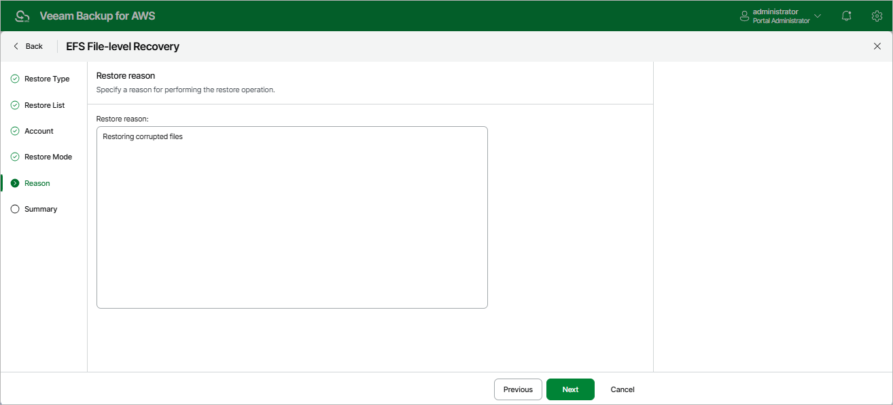

In this article

At the Reason step of the wizard, you can specify a reason for restoring the files and folders. The information you provide will be saved in the session history and you can reference it later.

Page updated 10/2/2025

Page content applies to build 10.0.0.232
