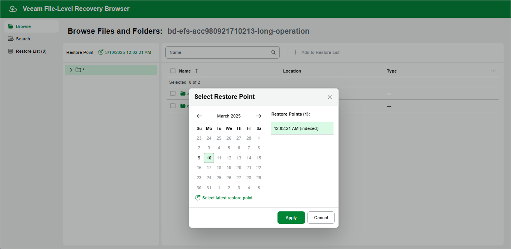

In this article

[This step applies only if you have selected the Browse files option at the Restore Type step of the wizard]

By default, Veeam Backup for AWS uses the most recent valid restore point. However, you can restore files and folders to an earlier state.

To select a restore point in the file-level recovery browser, do the following:

1. On the Browse tab, click the link next to the Restore Point field.
2. In the Select Restore Point window, choose a date when the restore point was created, select the necessary restore point from the Restore Points list and click Apply.

The Restore Points list shows only restore points that are associated with created EFS indexes.

|  |
| --- |
| Tip |
| You can search for the necessary files in all indexed restore points simultaneously. To do that, switch to the Search tab, specify the file or folder name, its location and click Search. |

Page updated 3/10/2025

Page content applies to build 10.0.0.232
