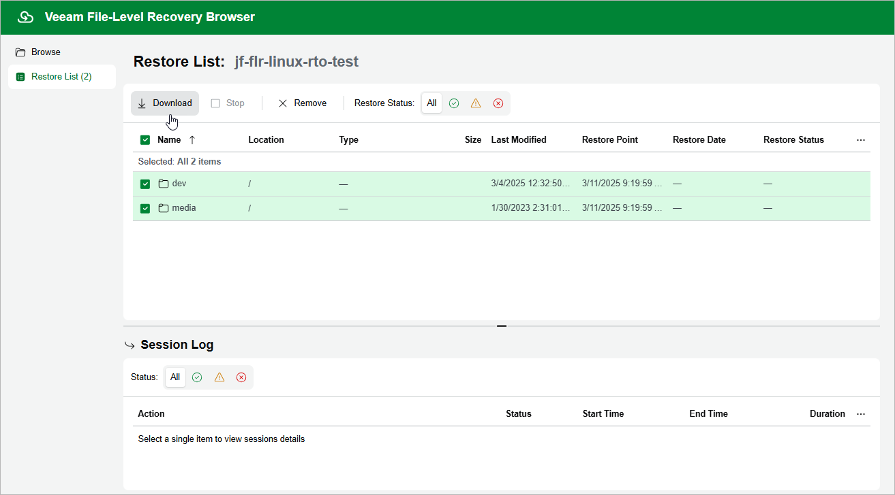

In this article

In the file-level recovery browser, you can find and recover items (files and folders) of the selected EC2 instance. All recovered items are either saved as a single .ZIP archive to the default download directory on a local machine from which you access the browser, or restored to the original EC2 instance.

To recover files and folders from a specific folder, do the following:

1. In the file-level recovery browser, navigate to a folder that contains the necessary files.
2. In the working area, select check boxes next to the files and click Add to Restore List.

|  |
| --- |
| Note |
| During file-level recovery from Linux-based EC2 instances, all files and folders are structured according to their physical location. That is why the file system tree displayed in the file-level recovery browser may differ from the logical file system tree of the processed EC2 instance. |

1. Repeat steps 1–2 for all other folders whose files you want to recover.
2. Switch to the Restore List tab, review the list of files and folders, select check boxes next to the items that you want to recover and do the following:

* To download the selected files and folders to the local machine, click Download.
* To download the selected files and folders to the source EC2 instance, click Restore > Keep.

Veeam Backup for AWS will save the files with the restored- prefix to the same directory where the source files are located.

* To restore the selected files and folders to the source EC2 instance, click Restore > Overwrite.

Veeam Backup for AWS will overwrite the source files.

As soon as you click Restore or Download, Veeam Backup for AWS will recover the selected files. You can track the progress and view the results of the restore operation in the Session Log section of the Restore List tab.

Page updated 10/2/2025

Page content applies to build 10.0.0.232
