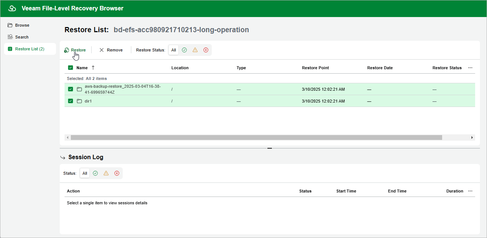

In this article

[This step applies only if you have selected the Browse files option at the Restore Type step of the wizard]

In the file-level recovery browser, you can find and recover items (files and folders) of the selected EFS file system. All recovered items are saved to the specified file system.

To select files and folders from the specific folder, do the following:

1. On the Browse tab, navigate to the folder that contains the necessary files.

1. In the working area, select check boxes next to the files and folders that you want to restore and click Add to Restore List.

1. Repeat steps 1-2 for all other files and folders that you want to restore.

If you want to restore different versions of a specific file or folder, select a new restore point as described in [Step 9. Select Restore Point](restore_item_restore_point_efs.md), and than repeat steps 1-2.

|  |
| --- |
| Tip |
| You can search for the necessary files in all indexed restore points simultaneously. To do that, switch to the Search tab, specify the file or folder name, its location and click Search. |

1. Switch to the Restore List tab.

1. On the Restore List tab, review the list files and folders, select check boxes next to the items that you want to recover and click Restore.

As soon as you click Restore, Veeam Backup for AWS will restore the selected files to the file system that you have specified at [step 4](restore_item_mode_efs.md) of the EFS File-level Recovery wizard. You can track the progress and view the results of the restore operation in the Session Log section of the Restore List tab.

Page updated 10/2/2025

Page content applies to build 10.0.0.232
