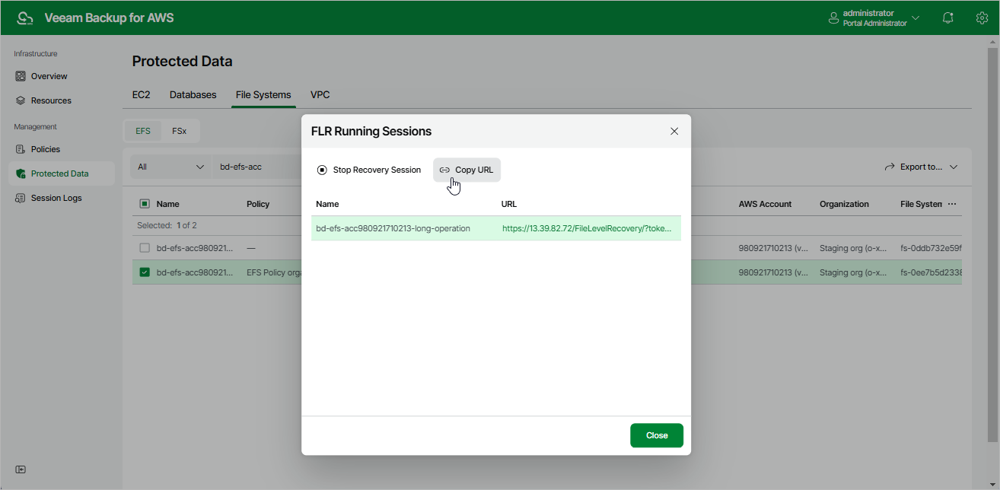

In this article

[This step applies only if you have selected the Browse files option at the Restore Type step of the wizard]

|  |
| --- |
| Tip |
| If you accidentally close the FLR Running Sessions window, navigate to Protected Data > File Systems > EFS and click the link in the File-Level Recovery URL column to open the window again. |

In the FLR Running Sessions window you can track the progress of the recovery session. In the URL column of the window, Veeam Backup for AWS will display a link to the file-level recovery browser. You can use the link in either of the following ways:

* Click the link to open the file-level recovery browser on your local machine while the recovery session is running.
* Copy the link, close the FLR Running Sessions window and open the file-level recovery browser on another machine.

|  |
| --- |
| Important |
| When you click Copy URL, Veeam Backup for AWS copies the following information to the clipboard:   * A link to the file-level recovery browser includes a public DNS name or an IP address of the backup appliance hosting the browser and authentication information used to access the browser. * A thumbprint of a TLS certificate installed on the appliance hosting the file-level recovery browser.   To avoid a man-in-the-middle attack, before you start recovering files and folders, check that the certificate thumbprint displayed in the web browser from which you access the file-level recovery browser matches the provided certificate thumbprint. |

Page updated 10/2/2025

Page content applies to build 10.0.0.232
