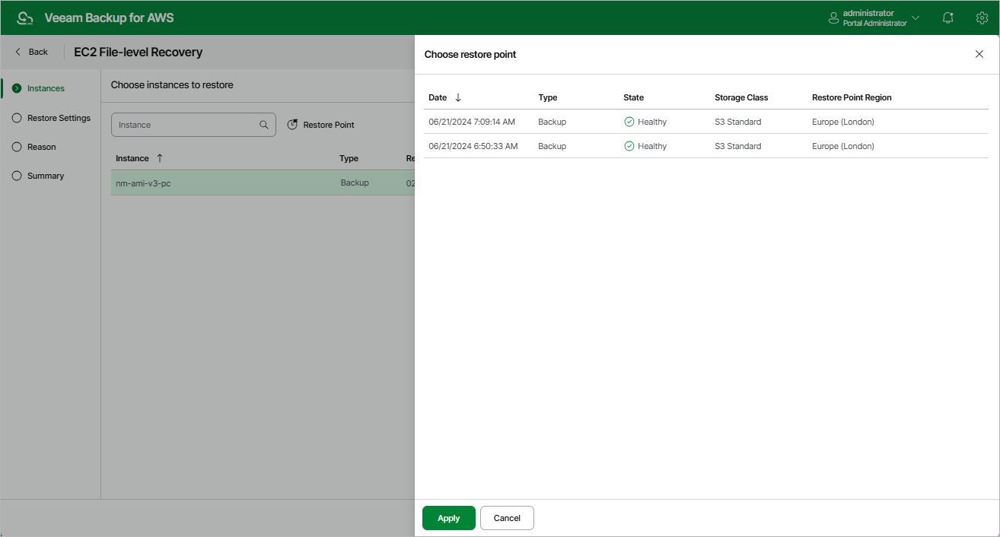

In this article

At the Instances step of the wizard, restore points to be used to perform the restore operation for the selected instance. By default, Veeam Backup for AWS uses the most recent valid restore point. However, you can restore files and folders of the backed-up EC2 instance to an earlier state.

To select a restore point, do the following:

1. Select the EC2 instance and click Restore Point.
2. In the Choose restore point window, select the necessary restore point and click Apply.

To help you choose a restore point, Veeam Backup for AWS provides the following information on each available restore point:

* Date — the date when the restore point was created.
* Type — the type of the restore point:

* Snapshot — a cloud-native snapshot created by a backup policy.
* Replica — a snapshot replica created by a backup policy.
* Manual Snapshot — a cloud-native snapshot created manually.
* Backup — an image-level backup created by a backup policy.
* Archive — an archived backup created by a backup policy.

* State — the state of the restore point (for image-level backups):

* Healthy — the restore point has been verified by the health check session and reported to be healthy.
* Incomplete — the restore point has been verified by the health check session and reported to be corrupted or incomplete.

* Storage Class — a storage class of the backup repository where the restore point is stored (for image-level backups).
* Restore Point Region — an AWS Region where the restore point is stored (for cloud-native snapshots and snapshot replicas) or where the backup repository is located (for image-level backups).

|  |
| --- |
| Important |
| To recover files and folders of an EC2 instance from a restore point that is stored in the archive backup repository of the S3 Glacier Flexible Retrieval or S3 Glacier Deep Archive storage class, you must retrieve the archived data manually before you begin the file-level recovery operation. For more information on data retrieval, see [Retrieving EC2 Data From Archive](data_retrieval.md). |

Page updated 9/29/2025

Page content applies to build 10.0.0.232
