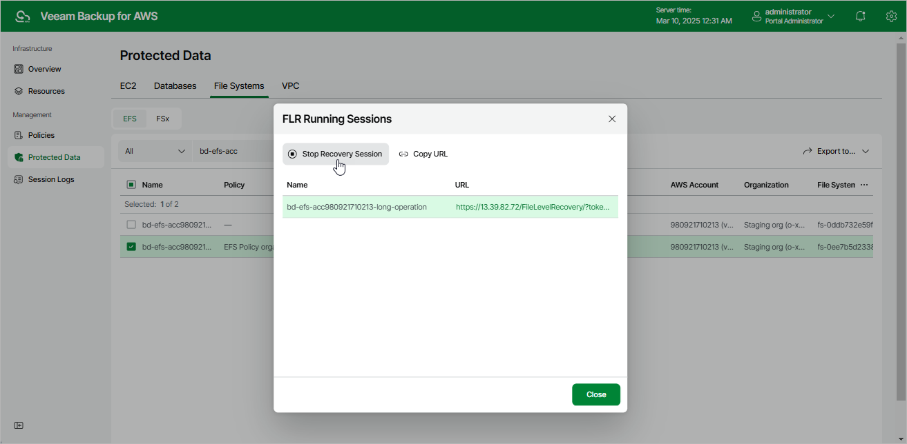

In this article

[This step applies only if you have selected the Browse files option at the Restore Type step of the wizard]

After you finish working with the file-level recovery browser, it is recommended that you stop the recovery session. To stop the recovery session, click Stop Recovery Session in the FLR Running Sessions window. If you do not perform any actions in the file-level recovery browser for 30 minutes, Veeam Backup for AWS will stop the recovery session automatically.

|  |
| --- |
| Tip |
| If you accidentally close the FLR Running Sessions window, navigate to Protected Data > File Systems > EFS and click the link in the File-Level Recovery URL column to open the window again. |

Page updated 3/10/2025

Page content applies to build 10.0.0.232
