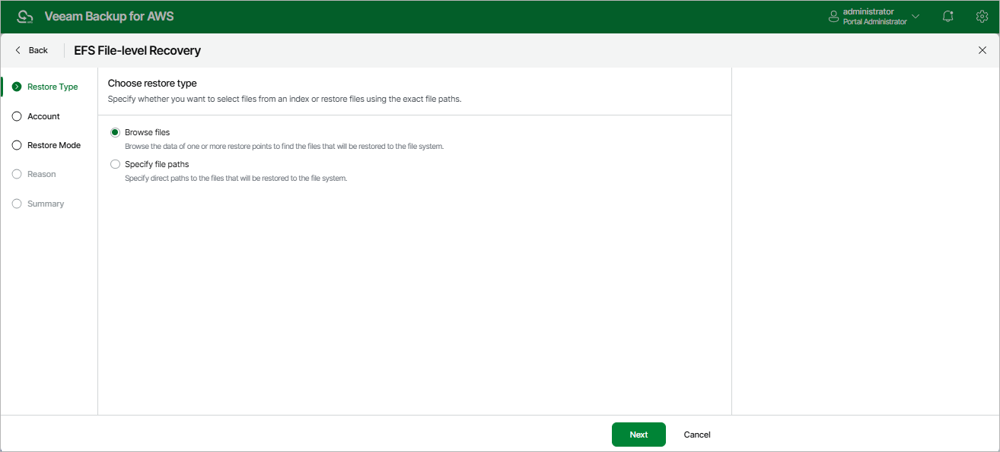

In this article

At the Restore Type step of the wizard, choose whether you want to specify the exact paths to files and folders that you want to recover, or to select specific files and folders in the file-level recovery browser.

|  |
| --- |
| Important |
| If you select the Browse files option, Veeam Backup for AWS will launch the EFS FLR session after you complete the EFS File-level Recovery wizard. Depending on the number of files stored in the file system, this session can consume up to 4 GB of RAM on the backup appliance. |

Page updated 10/2/2025

Page content applies to build 10.0.0.232
