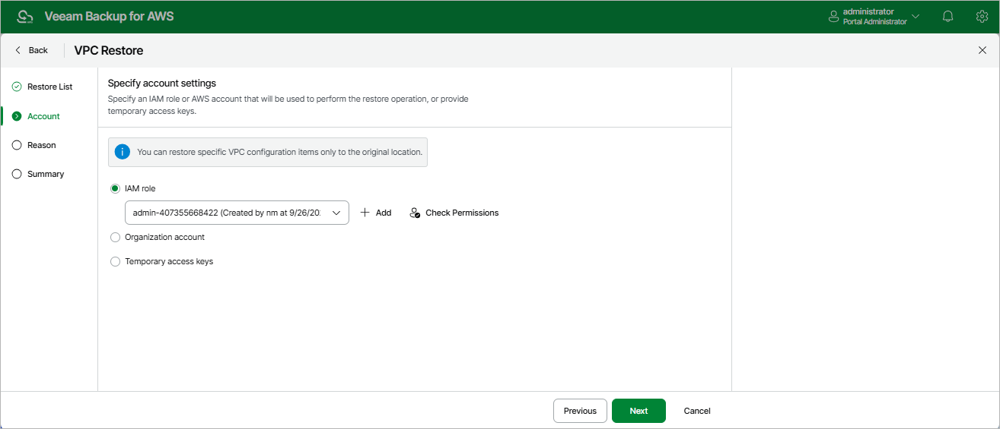

In this article

At the Account step of the wizard, choose whether you want to use an IAM role, an AWS account or one-time access keys of an IAM user to allow Veeam Backup for AWS to perform the restore operation. For information on the permissions that the IAM role or IAM user must have to perform the restore operation, see [VPC Configuration Restore IAM Permissions](role_permissions_restore_vpc.md).

|  |
| --- |
| Important |
| After you click Next, Veeam Backup for AWS will use the permissions of the specified IAM role or IAM user to validate the restore list created at [step 2](restore_items_vpc_point.md) of the wizard. If any of the VPC configuration items on which the selected items depend are missing from the current VPC configuration, Veeam Backup for AWS will open the Missing Configuration Items window with the list of the missing items. To proceed to the next step, click Add. The missing items will be automatically added to the restore list. |

Specifying IAM Role

To specify an IAM role to be used for the restore operation, select the IAM role option and choose the necessary IAM role from the list.

For an IAM role to be displayed in the IAM role list, it must be added to Veeam Backup for AWS with the Amazon VPC Restore operation selected as described in section [Adding IAM Roles](iam_roles_add.md). If you have not added the necessary IAM role to Veeam Backup for AWS beforehand, you can do it without closing the VPC Restore wizard. To do that, click Add and complete the Add IAM Role wizard.

|  |
| --- |
| Important |
| It is recommended that you check whether the selected IAM role has all the permissions required to perform the operation. If some permissions of the IAM role are missing, the restore operation may fail to complete successfully. To run the IAM role permission check, click Check Permissions and follow the instructions provided in section [Checking IAM Role Permissions](iam_roles_check.md#wizard). |

Specifying AWS Account

To specify an AWS account to be used for the restore operation, select the Organization account option. Since Veeam Backup for AWS does not support cross-account recovery of VPC configuratios, Veeam Backup for AWS automatically chooses the AWS account to which the source VPC configuration belong and the organization identity (either an entire AWS Organization or a limited scope of organizational units) that contains the account.

For an organization identity to be displayed in the list of available identities, it must be added to Veeam Backup for AWS as described in section [Adding AWS Organizations](organizations_add.md). For an AWS account to be displayed in the list of available accounts, it must be created in the the selected organization identity as described in [AWS Documentation](https://docs.aws.amazon.com/organizations/latest/userguide/orgs_manage_accounts_create.html).

Specifying One-Time Access Keys

To specify one-time access keys to be used for the restore operation, select the Temporary access keys option and use the Access key and Secret key fields to provide the access key ID and the secret access key.

|  |
| --- |
| Note |
| Veeam Backup for AWS does not store one-time access keys in the configuration database. |

Page updated 10/1/2025

Page content applies to build 10.0.0.232
