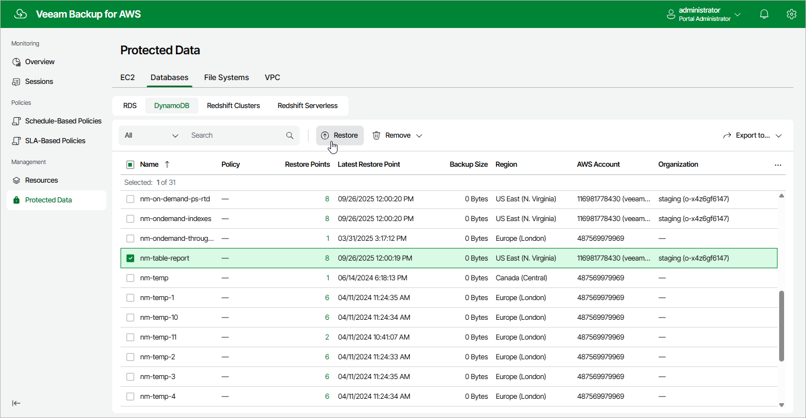

In this article

To launch the DynamoDB Restore wizard, do the following:

1. Navigate to Protected Data > Databases > DynamoDB.

1. Select the DynamoDB table that you want to restore.
2. Click Restore.

Alternatively, click the link in the Restore Points column. Then, in the Available Restore Points window, select the necessary restore point and click Restore.

|  |
| --- |
| Note |
| You can restore multiple DynamoDB tables if they belong to same AWS account only. |

Page updated 10/1/2025

Page content applies to build 10.0.0.232
