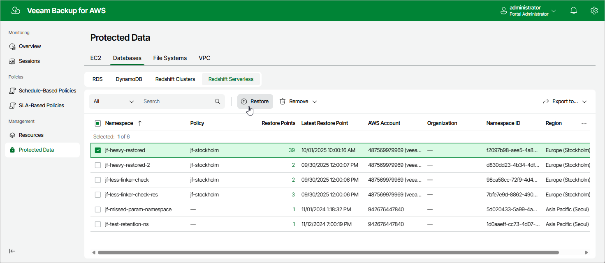

In this article

To launch the Redshift Serverless Restore wizard, do the following:

1. Navigate to Protected Data > Databases > Redshift Serverless.

1. Select the Redshift Serverless namespace that you want to restore.
2. Click Restore.

Alternatively, click the link in the Restore Points column. Then, in the Available Restore Points window, select the necessary restore point and click Restore.

Page updated 10/1/2025

Page content applies to build 10.0.0.232
