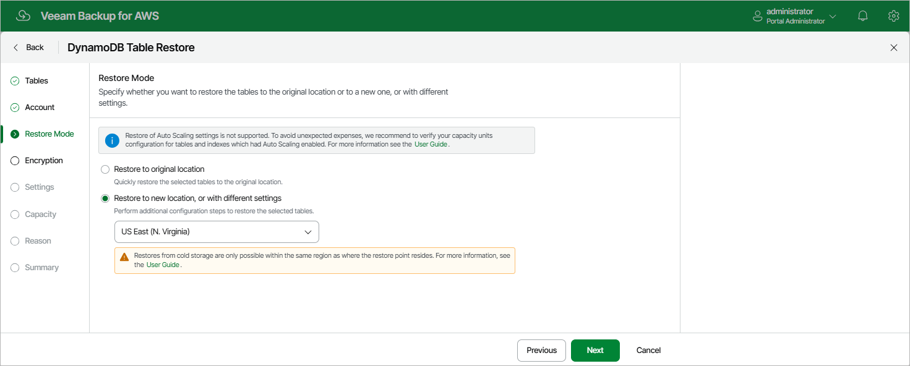

In this article

At the Restore Mode step of the wizard, choose whether you want to restore the selected DynamoDB table to the original or to a custom location. If you select the Restore to a new location, or with different settings option, specify the target AWS Region where the restored table will reside.

|  |
| --- |
| Important |
| If any of the restore options are not available, make sure that the selected restore points meet all the requirements listed at [step 2](restore_point_dynamo.md#reqs) of the wizard. |

Veeam Backup for AWS does not support restoring of provisioned throughput capacity values adjusted by Amazon DynamoDB auto scaling for tables and global secondary indexes (GSI). This means that if you add to the restore session a table with auto scaling enabled or a GSI-associated table with auto scaling enabled, the restore mode will affect the number of capacity units provisioned to the restored table or to the GSI:

* If you select the Restore to original location option, the restored table or GSI will be provisioned with the same numbers of capacity units that were used by the source table during the backup session. In this case, it is recommended to check values of capacity units for the restored table after the restore session completes to avoid unexpected charges.
* If you select the Restore to new location, or with different settings option, you will be able to specify the number of capacity units for the restored table at [step 7](restore_capacity_mode_dynamo.md) of the wizard, which will apply both to the table and to the GSI.

|  |
| --- |
| Tip |
| If some of the selected tables still exist in AWS, the wizard will display a notification message and restore to the original location will not be available. To work around the issues, you can do either of the following:   * Remove the source tables from AWS. * Use the Restore to new location, or with different settings option. In this case, you will also have to specify new names for the restored tables at [step 6](restore_type_dynamo.md) of the wizard. |

Page updated 10/2/2025

Page content applies to build 10.0.0.232
