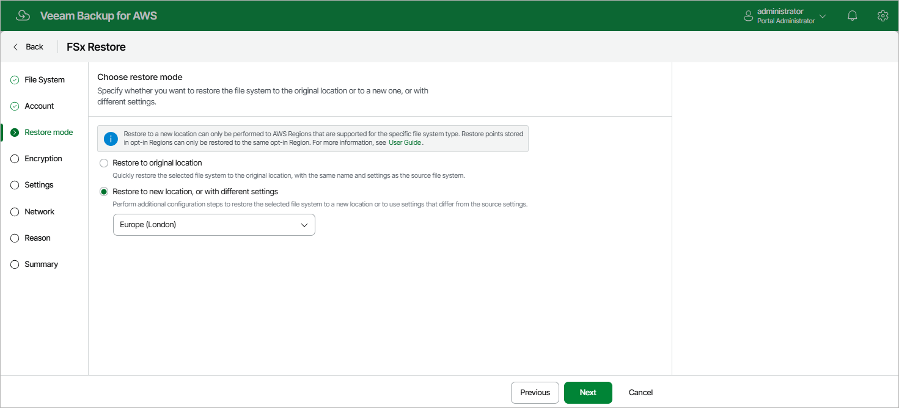

In this article

At the Restore Mode step of the wizard, choose whether you want to restore the selected FSx file system to the original or to a custom location.

|  |
| --- |
| Important |
| * If any of the restore options are not available, make sure that the selected restore points meet the requirements listed at [step 2](restore_point_fsx.md).  * If the file system that you want to restore is an Amazon FSx for Lustre system with the Persistent 2 deployment type or an Amazon for OpenZFS system with the Single-AZ 2 deployment type, make sure the target AWS Region is supported by this deployment type. Otherwise, the restore operation will fail to complete successfully. For the list of supported AWS Regions for Amazon FSx for Lustre file systems, see [AWS Documentation](https://docs.aws.amazon.com/fsx/latest/LustreGuide/using-fsx-lustre.html#persistent-deployment-regions). For the list of supported AWS Regions for Amazon OpenZFS file systems, see [AWS Documentation](https://docs.aws.amazon.com/fsx/latest/OpenZFSGuide/availability-durability.html#available-aws-regions). * If the file system that you want to restore is an FSx for Windows File Server file system associated with DNS aliases, keep in mind that Veeam Backup for AWS will not be able to restore these aliases to a new location or to the original location but with different settings. To learn how to manage DNS aliases, see [AWS Documentation](https://docs.aws.amazon.com/fsx/latest/WindowsGuide/managing-dns-aliases.html). |

If you select the Restore to a new location, or with different settings option, specify the target AWS Region where the restored file system will reside. Keep in mind that the list of available AWS Regions depends on the location of the restore point that you select at [step 2](restore_point_fsx.md) of the wizard due to AWS limitations for opt-in regions. That is, if the restore point is stored in an AWS Region activated for your AWS account by default, you will be able to select any of the default AWS Regions; if the restore point is stored in an opt-in Region, you will be able to select the source opt-in Region only.

Page updated 10/1/2025

Page content applies to build 10.0.0.232
