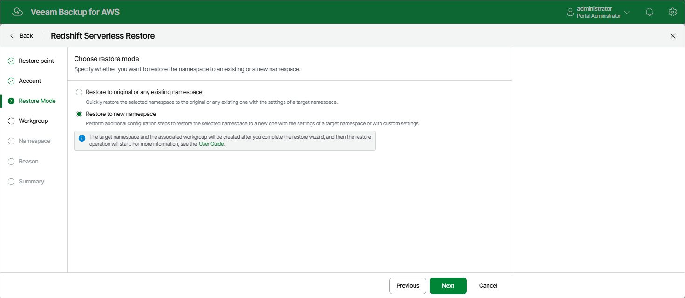

In this article

At the Restore Mode step of the wizard, choose either of the following options:

* Restore the selected Redshift Serverless namespace to the original or to any existing namespace. With this option selected, you will be able to restore the namespace with the settings of a target namespace only.
* Restore the selected Redshift Serverless namespace to a new namespace. With this option selected, you will be able to restore the namespace either with the settings of a target namespace or with custom settings.

If you select the Restore to new namespace option, you will need to perform additional configuration actions at [step 5](restore_redshift_serverless_workgroup.md) and [step 6](redshift_serverless_new_namespace.md) to create the target namespace and a workgroup associated with it. The target namespace and the new workgroup will be added to the AWS infrastructure only after you complete the restore wizard, and then the restore operation will start.

Page updated 10/1/2025

Page content applies to build 10.0.0.232
