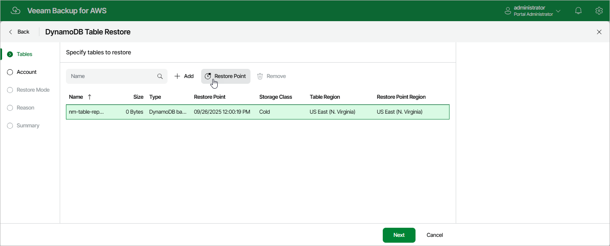

In this article

At the Tables step of the wizard, you can add DynamoDB tables to the restore session and select restore points to be used to perform the restore operation for each added table. By default, Veeam Backup for AWS uses the most recent valid restore point. However, you can restore a table to an earlier state.

To select a restore point, do the following:

1. Select the table and click Restore Point.
2. In the Choose restore point window, select the necessary restore point and click Apply.

To help you choose a restore point, Veeam Backup for AWS provides the following information on each available restore point:

* Date — the date when the restore point was created.
* Size — the size of the restore point.
* Type — the type of the restore point:

* DynamoDB backup — an DynamoDB backup created by a backup policy.
* DynamoDB backup copy — a backup copy created by a backup policy.
* Manual backup — a DynamoDB backup created manually.

* Storage Class — the storage class of the restore point.
* Restore Point Region — the AWS Region where the restore point is stored.

|  |
| --- |
| Important |
| Keep in mind that once stored in a cold storage tier in an AWS Region, backups cannot be copied to other AWS Regions. This means that you will only be able to use the backups to restore tables to the same AWS Region in which these backups reside after being moved from a warm storage tier. That is why if the selected restore points are stored in a cold storage tier in an AWS Region that differs from the AWS Region in which the backed-up tables reside, some of the [restore options](restore_mode_dynamo.md) may not be available. To work around the issue, you can do either of the following:   * If you plan to perform restore to the original location, select restore points that are stored in a cold storage tier in the same AWS Region in which the backed-up tables reside. * If you plan to perform restore either to a new location or to the original location but with different settings, select restore points that are stored in the target location. |

Page updated 10/1/2025

Page content applies to build 10.0.0.232
