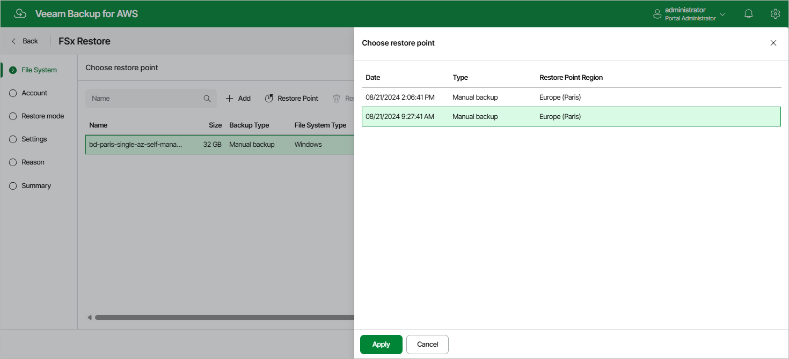

In this article

At the File System step of the wizard, you can add FSx file systems to the restore session and select restore points to be used to perform the restore operation for each added file system. By default, Veeam Backup for AWS uses the most recent valid restore point. However, you can restore a file system to an earlier state.

To select a restore point, do the following:

1. Select the file system and click Restore Point.
2. In the Choose restore point window, select the necessary restore point and click Apply.

To help you choose a restore point, Veeam Backup for AWS provides the following information on each available restore point:

* Date — the date when the restore point was created.
* Type — the type of the restore point:

* FSx backup — a FSx backup created by a backup policy.
* FSx backup copy — a FSx backup copy created by a backup policy.
* Manual backup — a FSx backup created manually.

* Restore Point Region — the AWS Region where the restore point is stored.

|  |
| --- |
| Important |
| Keep in mind that since Veeam Backup for AWS does not support cross-region copying of FSx backups for [opt-in Regions](https://docs.aws.amazon.com/controltower/latest/userguide/opt-in-region-considerations.html), some of the [restore options](restore_mode_fsx.md) may not be available. To work around the issue, is recommended that you select restore points stored in the same opt-in Region or the same default AWS Region (that is, one of the AWS Regions activated for your AWS account by default) if you plan to perform restore either to a new location or to the original location but with different settings. |

Page updated 10/1/2025

Page content applies to build 10.0.0.232
