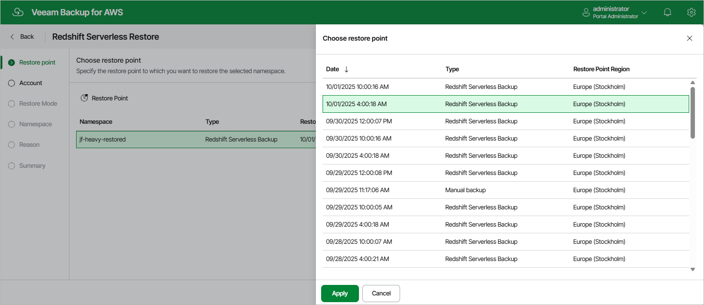

In this article

At the Restore Point step of the wizard, select a restore point that will be used to restore the selected Redshift Serverless namespace. By default, Veeam Backup for AWS uses the most recent valid restore point. However, you can restore the namespace data to an earlier state.

To select a restore point, do the following:

1. Click Restore Point.
2. In the Choose restore point window, select the necessary restore point and click Apply.

To help you choose a restore point, Veeam Backup for AWS provides the following information on each available restore point:

* Date — the date when the restore point was created.
* Type — the type of the restore point:

* Redshift Serverless backup — a Redshift Serverless backup created by a backup policy.
* Manual backup — a Redshift Serverless backup created manually.

* Restore Point Region — the AWS Region where the restore point is stored.

Page updated 10/1/2025

Page content applies to build 10.0.0.232
