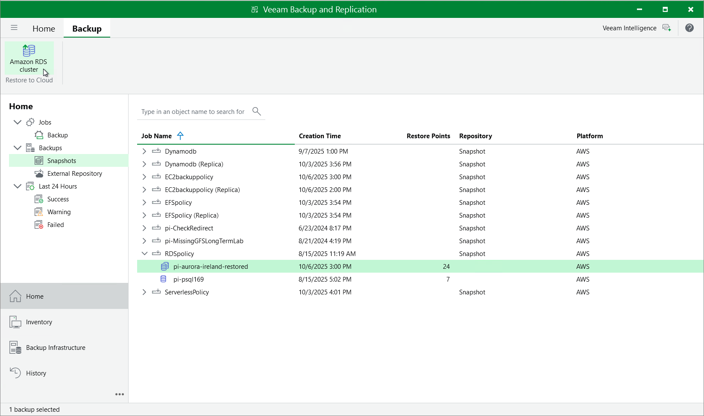

In this article

You can recover corrupted DB instances and Aurora DB clusters in the Veeam Backup for AWS Web UI only. However, you can launch the RDS Restore wizard directly from the Veeam Backup & Replication console to start the restore operation:

1. In the Veeam Backup & Replication console, open the Home view.
2. Navigate to Backups > Snapshots.
3. Expand the backup policy that protects a resource you want to recover and do the following:

1. If you want to restore a DB instance, select the necessary instance and click Amazon RDS on the ribbon.
2. If you want to restore a Aurora DB cluster, select the necessary cluster and click Amazon RDS cluster on the ribbon.

Alternatively, you can right-click the selected resource and click Restore to Amazon RDS or Amazon RDS cluster.

Veeam Backup & Replication will open the RDS Restore wizard in a web browser. Complete the wizard as described in section [RDS Restore Using Web UI](restore_rds_point.md).

Page updated 12/11/2025

Page content applies to build 10.0.0.232
