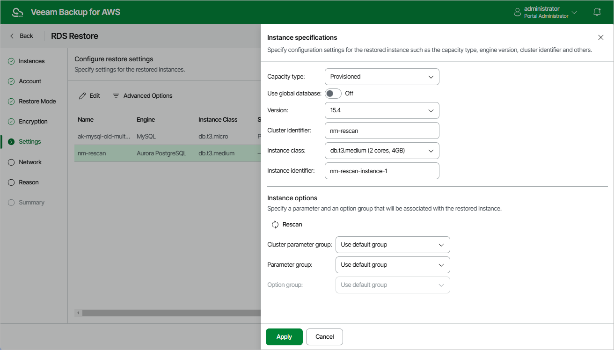

In this article

A number of settings that you can configure for a restored cluster depends on the capacity type that you plan to choose for the cluster. AWS supports Aurora DB clusters of 2 different capacity types:

* Aurora provisioned DB cluster — a cluster whose capacity is managed manually by creating DB instances: a single primary DB instance (writer) and multiple Aurora Replicas (readers) in Aurora DB clusters. For more information on provisioned DB clusters, see [AWS Documentation](https://docs.aws.amazon.com/AmazonRDS/latest/AuroraUserGuide/Aurora.Overview.html).
* Aurora Serverless v2 — a clusters whose capacity is scaled automatically according to the specified minimum and maximum capacity values. For more information on Aurora Serverless, see [AWS Documentation](https://docs.aws.amazon.com/AmazonRDS/latest/AuroraUserGuide/aurora-serverless-v2.html).

|  |
| --- |
| Note |
| You cannot change replication settings for restored Aurora DB clusters. Veeam Backup for AWS restores the clusters with the same replication settings configured for the source clusters. |

Configuring Restore Settings

To specify settings for a restored Aurora DB cluster, at the Settings step of the wizard, select the necessary cluster and click Edit. In the opened window, do the following:

1. In the Instance specifications section, specify configuration settings for the restored Aurora DB cluster:

1. Set the Use global database toggle to On if you plan that the restored cluster will have secondary DB clusters in a number of AWS Regions. In this case, the Version list will be filtered to show only Aurora database versions that support this feature. However, Veeam Backup for AWS will still create only a primary cluster in the AWS Region selected at [step 4](restore_rds_mode.md) of the wizard; secondary clusters must be created manually in the AWS Management Console after the restore operation completes.

For more information on Amazon Aurora global databases, see [AWS Documentation](https://docs.aws.amazon.com/AmazonRDS/latest/AuroraUserGuide/aurora-global-database.html).

1. [Applies only to Aurora MySQL DB clusters] Set the Use parallel query toggle to On if you plan to use the Aurora MySQL parallel query feature to improve I/O performance and to reduce network traffic in the restored cluster. In this case, the Version list will be filtered to show only Aurora database versions that support this feature. Keep in mind that to be able to use the feature, you must enable the aurora\_parallel\_query parameter in the DB cluster parameter group that you will specify in the Instance options section.

For more information on Aurora MySQL parallel query, see [AWS Documentation](https://docs.aws.amazon.com/AmazonRDS/latest/AuroraUserGuide/aurora-mysql-parallel-query.html).

1. From the Version drop-down list, select an Aurora database engine version for the restored cluster. The list shows only DB engine versions supported in the target AWS Region, and is filtered based on the DB engine type and DB engine version of the source Aurora DB cluster. The number of versions displayed in the list also depends on the source cluster replication settings and options that you have selected at steps 1b and 1c.

For more information on Amazon Aurora database engine versions, see [AWS Documentation](https://docs.aws.amazon.com/AmazonRDS/latest/AuroraUserGuide/Aurora.VersionPolicy.html#Aurora.VersionPolicy.Engines).

|  |
| --- |
| Note |
| If you restore Aurora PostgreSQL DB clusters and plan to use the Babelfish feature to allow the restored clusters to accept database connections from Microsoft SQL Server clients, note that this feature is supported only for Aurora PostgreSQL 13.4 and later engine versions. |

1. In the Cluster identifier field, specify an identifier for the restored cluster. Consider the following limitations:

* The cluster identifier must be unique for each AWS Region within one AWS Account.
* The cluster identifier can contain only lowercase Latin letters and hyphens, but cannot contain 2 consecutive hyphens.
* The first character of the cluster identifier must be a letter. The last character of the identifier must not be a hyphen.
* The maximum length of the cluster identifier is 63 characters.

For more information on limitations for Aurora DB cluster identifiers, see [AWS Documentation](https://docs.aws.amazon.com/AmazonRDS/latest/AuroraUserGuide/CHAP_Limits.html#RDS_Limits.Constraints).

1. From the Instance class drop-down list, select a DB instance class that Veeam Backup for AWS will use to create the primary DB instance in the restored cluster. For the list of all supported DB instance classes, see [AWS Documentation](https://docs.aws.amazon.com/AmazonRDS/latest/AuroraUserGuide/Concepts.DBInstanceClass.html#Concepts.DBInstanceClass.Types).

If you want to restore the primary DB instance of the provisioned cluster as an Aurora Serverless v2 DB instance, select db.serverless from the Instance class drop-down list. Consider that Aurora Serverless v2 is supported only for a limited list of DB engine versions. For more information, see [AWS Documentation](https://docs.aws.amazon.com/AmazonRDS/latest/AuroraUserGuide/aurora-serverless-v2.setting-capacity.html).

1. [Applies only to Aurora Serverless v2] Use the Minimum capacity and Maximum capacity fields to specify a range of capacity units that will be used to create scaling rules for the restored cluster. These rules define thresholds for CPU utilization, connections and available memory.

For more information on capacity units and scaling rules, see [AWS Documentation](https://docs.aws.amazon.com/AmazonRDS/latest/AuroraUserGuide/aurora-serverless.create.html).

1. In the Instance identifier field, specify an identifier for the primary DB instance in the restored cluster. Consider the following limitations:

* The instance identifier must be unique for each AWS Region within one AWS Account.
* The instance identifier can contain only lowercase Latin letters and hyphens, but cannot contain two consecutive hyphens.
* The first character of the instance identifier must be a letter. The last character of the identifier must not be a hyphen.
* The maximum length of the instance identifier is 63 characters.

For more information on limitations for DB instance identifiers, see [AWS Documentation](https://docs.aws.amazon.com/AmazonRDS/latest/UserGuide/CHAP_Limits.html#RDS_Limits.Constraints).

1. In the Instance options section, specify a DB cluster parameter group that will be associated with the restored cluster and a DB parameter group that will be associated with the primary DB instance:

1. From the Cluster parameter group drop-down list, select the DB cluster parameter group containing database engine configuration values that will be applied to every DB instance launched in the restored cluster.

For a DB cluster parameter group to be displayed in the list, the group must be created beforehand as described in [AWS Documentation](https://docs.aws.amazon.com/AmazonRDS/latest/AuroraUserGuide/USER_WorkingWithDBClusterParamGroups.html#USER_WorkingWithParamGroups.CreatingCluster).

1. From the Parameter group drop-down list, select the DB parameter group containing database engine configuration values that will be applied to the primary DB instance in the restored Aurora provisioned DB cluster or to the restored Aurora Serverless v2 cluster.

For a DB parameter group to be displayed in the list, the group must be created beforehand as described in [AWS Documentation](https://docs.aws.amazon.com/AmazonRDS/latest/AuroraUserGuide/USER_WorkingWithDBInstanceParamGroups.html#USER_WorkingWithParamGroups.Creating).

|  |
| --- |
| Note |
| If Veeam Backup for AWS cannot find any parameter groups in the target AWS Region, the Use default group option will be displayed. Use this option to associate the restored DB cluster and the primary DB instance with the default parameter groups that will be automatically created by AWS during the restore operation. |

1. Click Apply.

Page updated 9/29/2025

Page content applies to build 10.0.0.232
