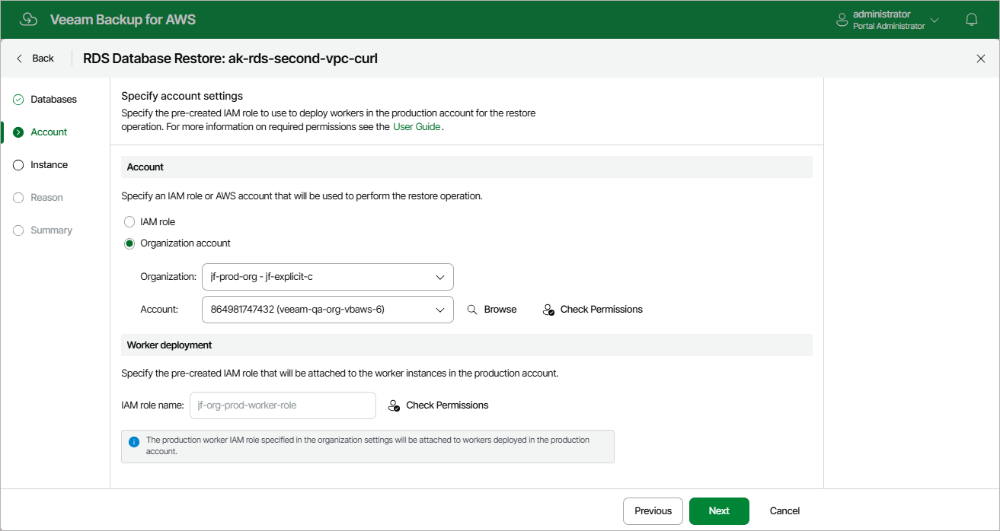

In this article

Depending on the option that you specify for the restore operation, the following will happen:

* If you select the IAM role option, you will be able to choose an IAM role that will be attached to the worker instances and used by Veeam Backup for AWS to communicate with these instances. The role you choose must belong to the same account to which the IAM role specified for the restore operation belongs, and must be assigned the permissions listed in section [Worker Deployment Role Permissions in Production Accounts](role_permissions_prod_acc.md#worker_reqs).

For an IAM role to be displayed in the list of available roles, it must be added to Veeam Backup for AWS with the Production worker role selected as described in section [Adding IAM Roles](https://helpcenter.veeam.com/docs/vbaws/guide/iam_roles_add.html). If you have not added the necessary IAM role to Veeam Backup for AWS beforehand, you can do it without closing the Add Policy wizard. To do that, click Add and complete the Add IAM Role wizard.

* If you have selected the Organization option, Veeam Backup for AWS will automatically choose an IAM role that will be attached to the worker instances and used by Veeam Backup for AWS to communicate with these instances. It will be one of the roles specified in the settings of the selected organization identity — either the IAM role whose permissions will be used to perform the backup operation (that is, the Backup and restore IAM role), or the IAM role that will be attached to the worker instances and used by Veeam Backup for AWS to communicate with these instances (that is, the Production worker IAM role).

For Veeam Backup for AWS to be able to choose an IAM role automatically, it must be created in all AWS accounts belonging to the selected organization identity, and specified in the organization settings as described in section [Adding AWS Organizations](organization_add_settings.md#backup_role) (step 3).

|  |
| --- |
| Important |
| If you select the IAM role option, it is recommended that you check whether both the IAM role that will be used to perform the restore operation and the IAM role that will be attached to the worker instances have the required permissions — if some of the permissions are missing, the restore operation may fail to complete successfully. To run the IAM role permission check, click Check Permissions and follow the instructions provided in section [Checking IAM Role Permissions](iam_roles_check.md#wizard). |

Worker Instance Requirements

To restore DB instance databases from image-level backups, Veeam Backup for AWS deploys worker instances in an AWS Region where DB instance that will host the restored databases resides in an AWS account to which the instance belongs. By default, Veeam Backup for AWS uses the most appropriate network settings of AWS Regions to deploy worker instances. However, you can add [specific worker configurations](worker_add_config_prod.md) that will be used to deploy worker instances used for database restore operations.

If no specific [worker configurations](worker_add_config_prod.md) are added to Veeam Backup for AWS, the most appropriate network settings of AWS Regions are used to deploy worker instances for the database restore operation. For Veeam Backup for AWS to be able to deploy a worker instance used to perform the restore operation:

* The DNS resolution option must be enabled for the VPC network. For more information, see [AWS Documentation](https://docs.aws.amazon.com/vpc/latest/userguide/working-with-vpcs.html#Create-VPC).
* As Veeam Backup for AWS uses public access to communicate with worker instances, the [public IPv4 addressing](https://docs.aws.amazon.com/vpc/latest/userguide/working-with-subnets.html#subnet-public-ip) attribute must be enabled at least for one subnet in the Availability Zone where the DB instance resides and the VPC network to which the subnet belongs must have an [internet gateway attached](https://docs.aws.amazon.com/vpc/latest/userguide/VPC_Internet_Gateway.html). VPC network and subnet route tables must have routes that direct internet-bound traffic to this internet gateway.

If you want worker instances to operate in a private network, enable the [private network deployment](enable_private_network_deployment.md) functionality and configure [specific VPC endpoints](configuring_private_networks.md) for the subnet to let Veeam Backup for AWS use private IPv4 addresses. Alternatively, configure VPC interface endpoints as described in section [Appendix C. Configuring Endpoints in AWS](configure_endpoints.md).

|  |
| --- |
| Note |
| During RDS image-level backup operations, Veeam Backup for AWS creates 2 additional security groups that are further associated with the source DB instances and worker instances to allow direct network traffic between them. To learn how DB instance database restore works, see [Database Restore](restore_hiw_rds_database.md). |

Page updated 11/21/2025

Page content applies to build 10.0.0.232
