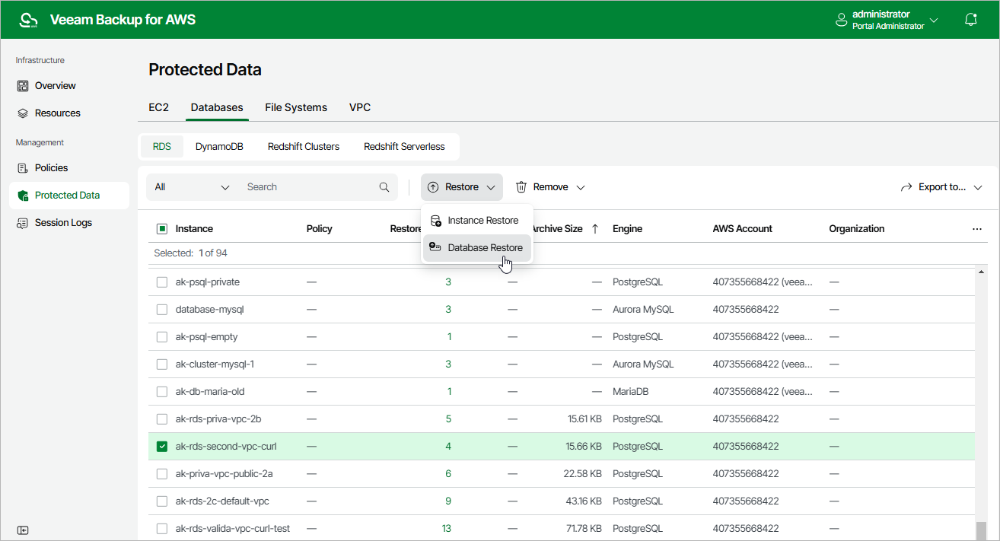

In this article

To launch the RDS Database Restore wizard, do the following.

1. Navigate to Protected Data > Databases > RDS.
2. Select the DB instance whose databases you want to restore, and click Restore > Database Restore.

Alternatively, click the link in the Restore Points column. Then, in the Available Restore Points window, select the necessary restore point and click Restore > Database Restore.

Page updated 7/21/2025

Page content applies to build 10.0.0.232
