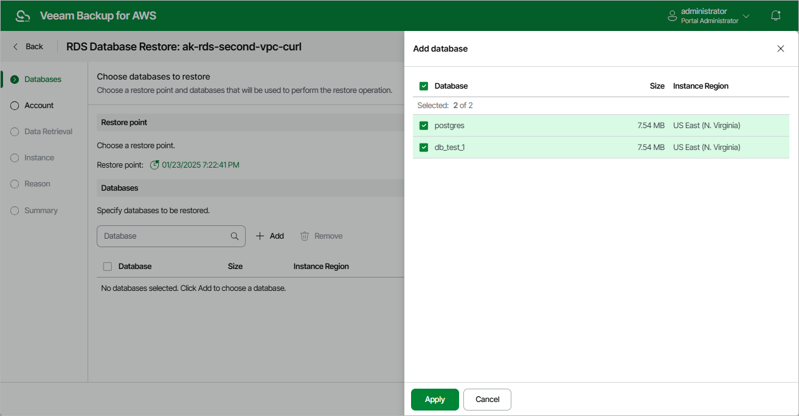

In this article

At the Databases step of the wizard, you can add databases to the restore session and select a restore point that will be used to perform the restore operation for each database. By default, Veeam Backup for AWS uses the most recent valid restore point. However, you can restore the database data to an earlier state.

To help you choose a restore point, Veeam Backup for AWS provides the following information on each available restore point:

* Date — the date when the restore point was created.
* Type — the type of the restore point:

* Backup — an image-level backup created by a backup policy.
* Archive — an archived backup created by a backup policy.

* State — the state of the restore point stored in the standard backup repository:

* Healthy — the restore point has been verified by the health check session and reported to be healthy.
* Incomplete — the restore point has been verified by the health check session and reported to be corrupted or incomplete.

* Storage Class — the storage class of the backup repository where the restore point is stored.
* Restore Point Region — the AWS Region where the restore point is stored.

|  |
| --- |
| Important |
| For Microsoft SQL Server DB instances, Veeam Backup for AWS does not support restoring databases that contain the FILESTREAM file group. |

Page updated 10/8/2025

Page content applies to build 10.0.0.232
