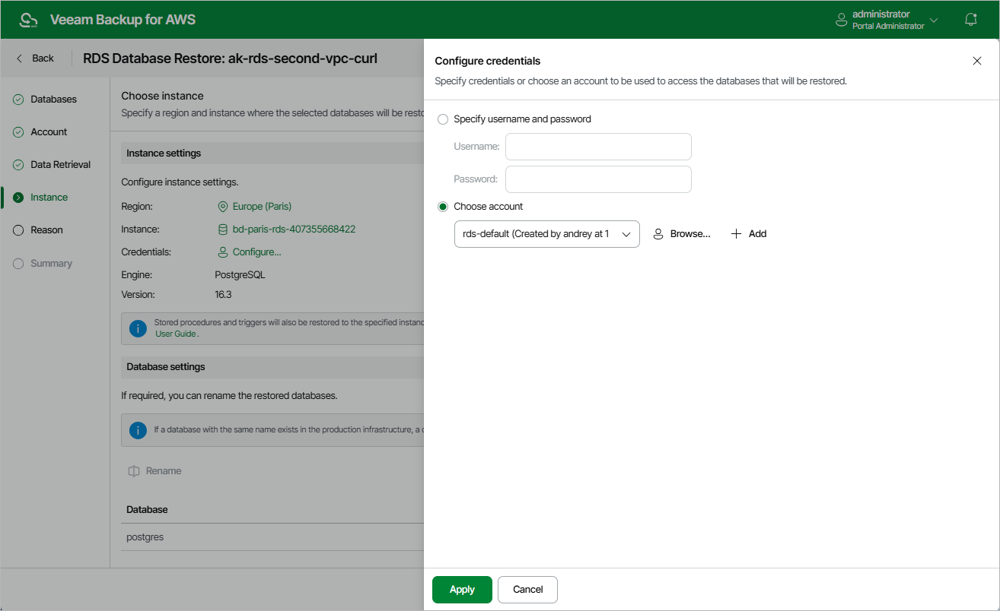

In this article

At the Instance step of the wizard, specify the target AWS Region where a DB instance will host the restored databases, and choose the target DB instance. For an instance to be displayed in the list of available instances, it must reside in the selected AWS Region and belong to the AWS account specified at [step 3](restore_rds_database_workers.md) of the wizard.

|  |
| --- |
| Note |
| If the specified target region is the same region where the source DB instance resided and if the specified DB instance is the same instance that hosted the source databases, the next run of the backup policy protecting the source DB instance will take more time to complete in case the restore operation completes successfully. This is the expected behavior caused by [AWS technical limitations](https://docs.aws.amazon.com/ebs/latest/userguide/ebs-initialize.html). |

You must also specify credentials of a database account that Veeam Backup for AWS will use to connect to the target DB instance. To do that, click the link next to the Credentials field. In the Configure credentials window, choose whether you want to provide temporary credentials or select an existing database account. Keep in mind that the specified account will become the owner of all restored databases.

For an account to be displayed in the list of available accounts, it must be added to Veeam Backup for AWS as described in section [Adding Database Accounts](accounts_database_create.md). If you have not added the necessary account beforehand, click Add and complete the Add Account wizard.

|  |
| --- |
| Tip |
| By default, Veeam Backup for AWS restores each database with the same name as the original database. If a database with this name already exists in the production infrastructure, a default suffix is added to the database name automatically. You can also specify a new name for each restored database manually — to do that, select the database in the Database settings section and click Rename. |

Considerations and Limitations

When you restore databases, consider the following:

* Make sure that the specified database account exists on the target DB instance. Otherwise, the restore operation will fail to complete successfully.
* Veeam Backup for AWS does not support restoring original database accounts, including their predefined roles and access privileges. Therefore, you will have to manually recreate these accounts on the restored databases and reassign their privileges after the restore process completes.

* [Applies only to Microsoft SQL Server DB instances] Veeam Backup for AWS does not support restoring databases of DB instances that have a zero backup retention period to DB instances that have a nonzero retention period due to the incompatibility in database recovery models. This is the expected behavior caused by [AWS technical limitations](https://docs.aws.amazon.com/AmazonRDS/latest/UserGuide/Appendix.SQLServer.CommonDBATasks.DatabaseRecovery.html).
* [Applies only to Microsoft SQL Server DB instances] Make sure that the target DB instance is set to the same time zone as the source DB instance. Otherwise, your applications may encounter data consistency issues.
* [Applies only to Microsoft SQL Server DB instances] Make sure that the target DB instance runs the same or a later engine version as the source DB instance. Otherwise, the restore operation will fail to complete successfully.

Page updated 12/12/2025

Page content applies to build 10.0.0.232
