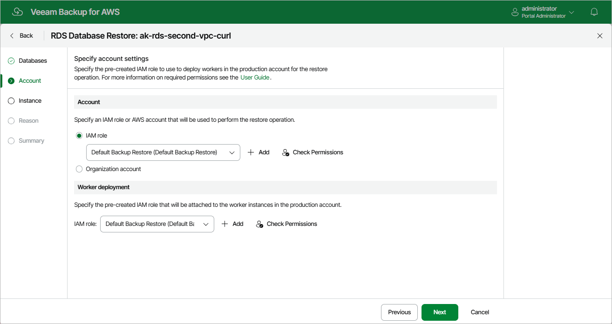

In this article

At the Account step of the wizard, choose whether you want to use an IAM role of a standalone AWS account or an AWS account of an AWS Organization to allow Veeam Backup & Replication to perform the restore operation. For information on the permissions that the IAM role must have to perform the restore operation, see [RDS Database Restore IAM Permissions](role_permissions_restore_db.md).

Depending on whether the AWS account to which the source DB instances belong is a part of an AWS Organization, Veeam Backup for AWS automatically does either of the following:

* If the AWS account is a part of an AWS Organization, Veeam Backup for AWS chooses the AWS account itself and the organization identity that contains the account — in this case, the Organization account option is selected by default.
* If the AWS account is not a part of an AWS Organization, Veeam Backup for AWS chooses an IAM role from the AWS account — in this case, the IAM Role option is selected by default.

|  |
| --- |
| Important |
| For Veeam Backup for AWS to be able to perform the restore operation, you must also specify an IAM that will be attached to the worker instances and used by Veeam Backup for AWS to communicate with these instances. For more information, see [Configuring Worker Settings](restore_rds_database_account_2.md). |

Specifying IAM Role from Single AWS Account

To specify an IAM role to be used for the restore operation, select the IAM role option and choose the necessary IAM role from the list. Keep in mind that the selected role must belong to an AWS account to which you plan to restore RDS resources.

For an IAM role to be displayed in the list of available roles, it must be added to Veeam Backup for AWS with the Amazon RDS Restore operation selected as described in section [Adding IAM Roles](iam_roles_add.md). If you have not added the necessary IAM role to Veeam Backup for AWS beforehand, you can do it without closing the RDS Database Restore wizard. To do that, click Add and complete the Add IAM Role wizard.

|  |
| --- |
| Important |
| It is recommended that you check whether the selected IAM role has all the permissions required to perform the operation. If some permissions of the IAM role are missing, the restore operation may fail to complete successfully. To run the IAM role permission check, click Check Permissions and follow the instructions provided in section [Checking IAM Role Permissions](iam_roles_check.md#wizard). |

Specifying AWS Account Within AWS Organization

To specify an AWS account to be used for the restore operation, select the Organization account option and do the following:

1. From the Organization drop-down list, choose the necessary organization identity — either an entire AWS Organization or a limited scope of organizational units.

For an organization or a scope of organizational units to be displayed in the list of available identities, it must be added to Veeam Backup for AWS as described in section [Managing AWS Organizations](managing_organizations.md).

1. From the Account drop-down list, choose an account that contains the IAM role whose permissions will be used to perform the restore operation. The role must be specified in the settings of the selected organization identity, as described in section [Adding AWS Organizations](organization_add_settings.md#backup_role) (step 3).

For an AWS account to be displayed in the list of available accounts, it must be included in the the selected organization identity.

Page updated 7/21/2025

Page content applies to build 10.0.0.232
