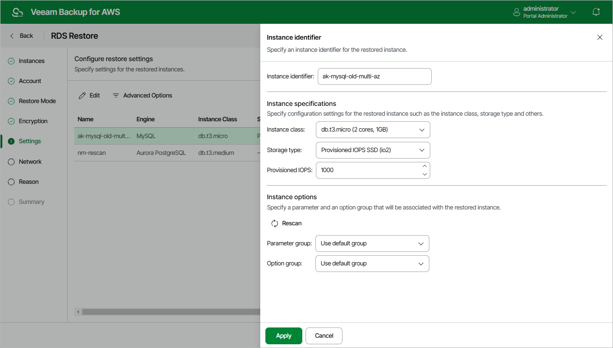

In this article

To configure settings for a restored DB instance, at the Settings step of the wizard, select the necessary instance and click Edit. In the opened window, do the following:

1. In the Instance identifier section, specify an identifier for the restored DB instance. Consider the following limitations:

* The instance identifier must be unique for each AWS Region within one AWS Account.
* The instance identifier can contain only lowercase Latin letters and hyphens, but cannot contain two consecutive hyphens.

* The first character of the instance identifier must be a letter. The last character of the identifier must not be a hyphen.

* The maximum length of the instance identifier is 63 characters.

For more information on limitations for DB instance identifiers, see [AWS Documentation](https://docs.aws.amazon.com/AmazonRDS/latest/UserGuide/CHAP_Limits.html#RDS_Limits.Constraints).

1. In the Instance specifications section, choose a DB instance class and storage type for the restored instance. If you choose the Provisioned IOPS (SSD) storage type, you must also specify an IOPS rate.

For the list of all supported DB instance classes and available storage types, see [AWS Documentation](https://docs.aws.amazon.com/AmazonRDS/latest/UserGuide/Welcome.html).

1. In the Instance options section, specify a parameter group and an option group that will be associated with the restored instance:

1. From the Parameter group drop-down list, select the parameter group containing database engine configuration values that will be applied to the restored DB instance.

For a parameter group to be displayed in the list of available groups, the group must be created beforehand as described in [AWS Documentation](https://docs.aws.amazon.com/AmazonRDS/latest/UserGuide/USER_WorkingWithParamGroups.html).

1. [This step does not apply to DB instances running the PostgreSQL database engine] From the Option group drop-down list, select the option group containing database configuration values and security settings that will be applied to the restored DB instance.

For an option group to be displayed in the list of available groups, the group must be created beforehand as described in [AWS Documentation](https://docs.aws.amazon.com/AmazonRDS/latest/UserGuide/USER_WorkingWithOptionGroups.html).

|  |
| --- |
| Note |
| If you select the Use default group option, Veeam Backup for AWS will associate the restored DB instance with the default parameter group and the default option group automatically created by AWS during the restore operation. |

1. Click Apply.

Page updated 9/29/2025

Page content applies to build 10.0.0.232
