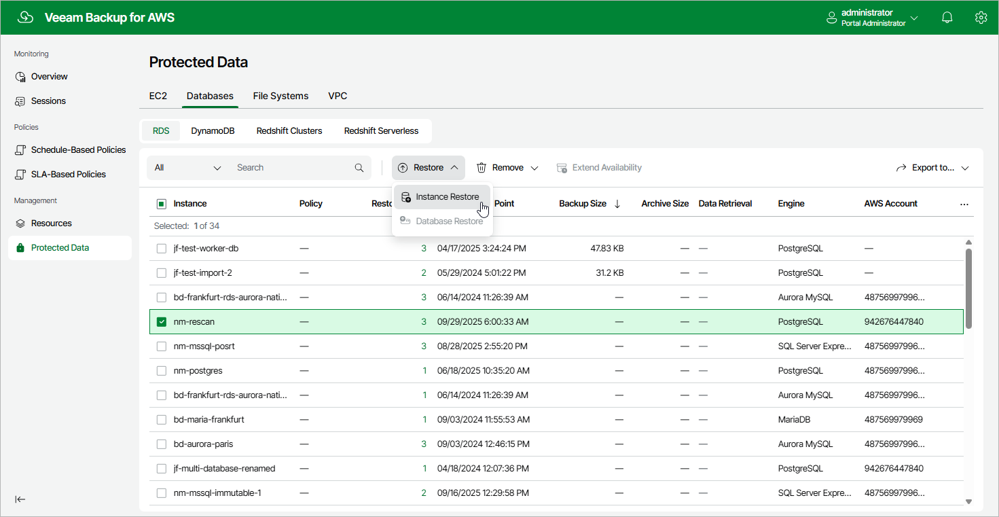

In this article

To launch the RDS Restore wizard, do the following:

1. Navigate to Protected Data > Databases > RDS.
2. Select the RDS resource you want to restore.
3. Click Restore > Instance Restore.

Alternatively, click the link in the Restore Points column. Then, in the Available Restore Points window, select the necessary restore point and click Restore.

Page updated 9/29/2025

Page content applies to build 10.0.0.232
