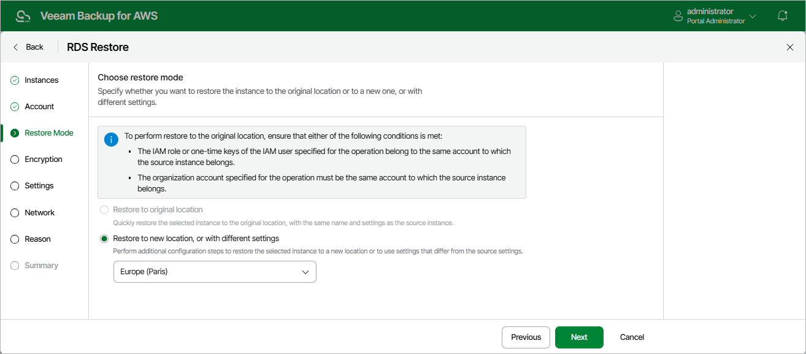

In this article

At the Restore Mode step of the wizard, choose whether you want to restore the selected RDS resources to the original or to a custom location. If you select the Restore to new location, or with different settings option, specify the target AWS Region where the restored DB instances and Aurora DB clusters will operate.

Considerations and Limitations

When you restore RDS resources, consider the following:

* When restoring Aurora DB clusters that are part of an Amazon Aurora global database, Veeam Backup for AWS restores only the primary clusters in the primary AWS Region. Secondary clusters must be created manually in the AWS Management Console after the restore operation completes.

For more information on Amazon Aurora Global Database feature, see [AWS Documentation](https://docs.aws.amazon.com/AmazonRDS/latest/AuroraUserGuide/aurora-global-database.html).

* When restoring Aurora DB clusters to a new location, Veeam Backup for AWS creates only primary DB instances in the restored clusters. Additional writer DB instances (for Aurora multi-master clusters) or Aurora Replicas (for Aurora DB clusters with single-master replication) must be added manually in the AWS Management Console after the restore operation completes.

To learn how to add DB instances to Amazon Aurora DB clusters, see [AWS Documentation](https://docs.aws.amazon.com/AmazonRDS/latest/AuroraUserGuide/aurora-replicas-adding.html).

* Veeam Backup for AWS does not support restoring RDS resources to the original location if the IAM role specified for the restore operation belongs to an AWS account that differs from the AWS account to which the source resources belong.
* Veeam Backup for AWS does not support restoring RDS resources to the original location if deletion protection is enabled for the source resource.

Page updated 12/12/2025

Page content applies to build 10.0.0.232
