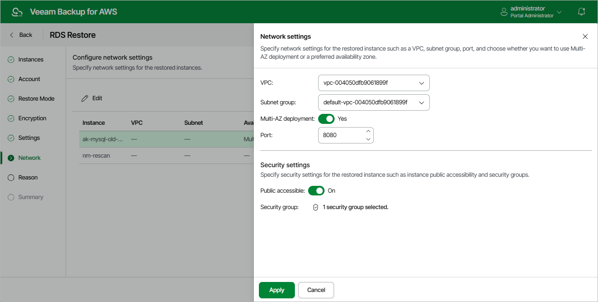

In this article

[This step applies only if you have selected the Restore to a new location, or with different settings option at the Restore Mode step of the wizard]

At the Network step of the wizard, configure network and security settings for the restored DB instances and Aurora DB clusters. To do that, select the necessary RDS resource and click Edit. In the opened window, do the following:

1. In the Network settings section, specify network settings for the restored RDS resource:

* For a restored DB instance, choose an Amazon VPC network to which the instance will be connected, a subnet group that will be assigned to the instance, an Availability Zone where the instance will reside, and a port that will be used to access the DB instance. Note that the VPC list shows only Amazon VPCs that include one or more subnet groups.

For a VPC network and a subnet group to be displayed in the lists of available network specifications, they must be created in the AWS Region specified at [step 4](restore_rds_mode.md) of the wizard as described in [AWS Documentation](https://docs.aws.amazon.com/vpc/latest/userguide/what-is-amazon-vpc.html).

|  |
| --- |
| Tip |
| If you want to create a passive secondary replica (standby instance) of the restored DB instance, set the Multi-AZ deployment toggle to On. Keep in mind that Multi-AZ deployments are not supported for instances running MS SQL Server Express and MS SQL Server Web editions. For more information on Multi-AZ deployments, see [AWS Documentation](https://docs.aws.amazon.com/AmazonRDS/latest/UserGuide/Concepts.MultiAZ.html). |

* For a restored Aurora DB cluster, choose an Amazon VPC network to which the cluster will be restored, a subnet group that includes at least two subnets created in two different Availability Zones of the AWS Region specified at [step 4](restore_rds_mode.md) of the wizard, an Availability Zone where the primary DB instance will reside, and a port that will be used to access the primary DB instance.

1. In the Security settings section, specify security settings to control what IP addresses will be able to connect to databases of the restored RDS resource.

1. To make the RDS resource accessible outside the selected Amazon VPC network, set the Public accessible toggle to On. Note that the RDS resource must belong to a public subnet group to become publicly accessible.
2. To specify security groups that will control access to the RDS resource, click the link next to the Security group field and then select the necessary groups in the Select Security Group window.

1. Click Apply.

Page updated 9/29/2025

Page content applies to build 10.0.0.232
