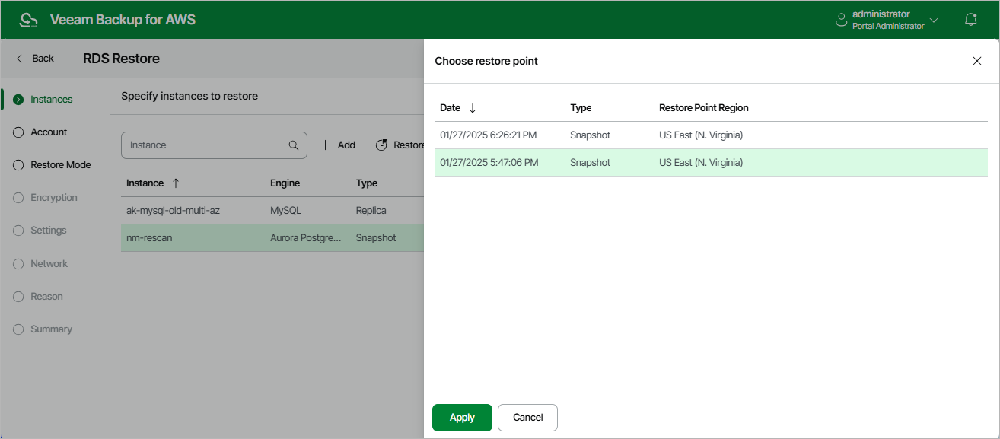

In this article

At the Instances step of the wizard, you can add DB instances and Aurora DB clusters to the restore session and select restore points to be used to perform restore for each added RDS resource. By default, Veeam Backup for AWS uses the most recent valid restore point. However, you can restore an RDS resource to an earlier state.

To select a restore point, do the following:

1. Select the DB instance or Aurora DB cluster, and click Restore Point.
2. In the Choose restore point window, select the necessary restore point and click Apply.

To help you choose a restore point, Veeam Backup for AWS provides the following information on each available restore point:

* Date — the date when the restore point was created.
* Type — the type of the restore point:

* Snapshot — a cloud-native snapshot created by a backup policy.
* Replica — a snapshot replica created by a backup policy.
* Manual Snapshot — a cloud-native snapshot created manually.

* Restore Point Region — the AWS Region where the restore point is stored.

Page updated 9/29/2025

Page content applies to build 10.0.0.232
