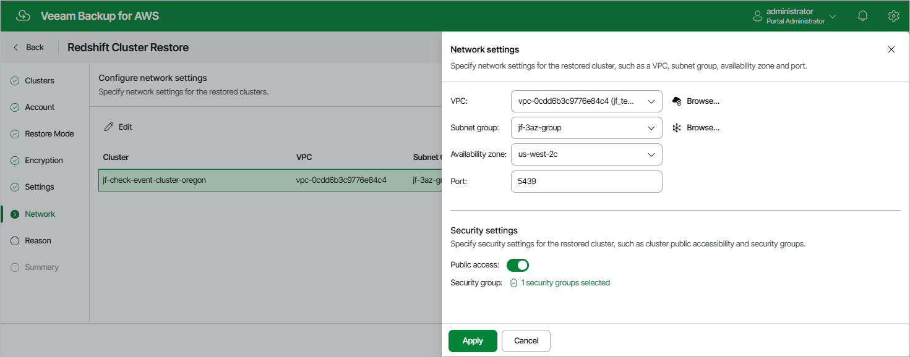

In this article

[This step applies only if you have selected the Restore to original location with different settings option at the Restore Mode step of the wizard]

At the Network step of the wizard, configure network and security settings for the restored Redshift cluster. To do that, select the necessary cluster and click Edit. In the opened window, do the following:

1. In the Network settings section, choose an Amazon VPC network where the restored cluster will be deployed, a subnet group in which the cluster will be launched, an Availability Zone where the cluster will reside, and a port that will be used to access the cluster.

For a VPC network and a subnet group to be displayed in the lists of available network specifications, they must be created in the AWS Region where the source cluster resides, as described in [AWS Documentation](https://docs.aws.amazon.com/vpc/latest/userguide/what-is-amazon-vpc.html).

1. In the Security settings section, specify security settings to control what IP addresses will be able to connect to databases in the restored cluster.

1. To make the cluster accessible outside the selected Amazon VPC network, set the Public accessible toggle to On. Note that the cluster must belong to a public subnet group to become publicly accessible.
2. To specify security groups that will control access to the cluster, click the link next to the Security group field, and then select the necessary groups in the Select Security Group window. Note that you cannot associate more than 5 security groups with the cluster.

1. To save changes made to the cluster settings, click Apply.

Page updated 10/1/2025

Page content applies to build 10.0.0.232
