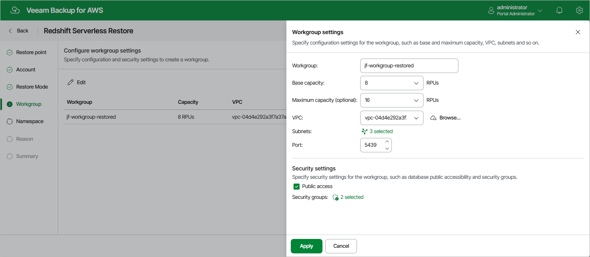

In this article

[This step applies only if you have selected the Restore to new namespace option at the Restore Mode step of the wizard]

By default, the new workgroup that will be created and associated with the restored Redshift Serverless namespace will have the same settings as the source namespace. At the Workgroup step of the wizard, you can adjust these settings:

1. Click Edit.
2. In the Workgroup configuration section, do the following:

1. In the Workgroup field, enter a new name for the workgroup. Note that the name must be unique in AWS.
2. From the Base capacity and Maximum capacity (optional) drop-down lists, select the amount of compute resources that will be allocated to the workgroup.

|  |
| --- |
| Important |
| Veeam Backup for AWS does not support the AI-driven scaling and optimization feature. |

1. From the VPC drop-down list, choose an Amazon VPC network where the restored namespace will be deployed.

For a VPC network to be displayed in the lists of available networks, it must be created in the AWS Region where the source namespace resides, as described in [AWS Documentation](https://docs.aws.amazon.com/vpc/latest/userguide/create-vpc.html).

1. Specify subnets that will be associated with the restored namespace. To do that, click Choose next to the Subnet field, and select the necessary subnets in the Select Subnets window. Note that you must choose the minimum required number of subnets (2 or 3) from different Availability Zones — the exact number depends on the restore point selected at [step 2](restore_point_redshift_serverless.md) of the wizard. For subnets in the US West (N. California) Region, select 2 subnets from 2 different Availability Zones.

For a subnet to be displayed in the list of available subnets, it must be created in the AWS Region where the source namespace resides, as described in [AWS Documentation](https://docs.aws.amazon.com/vpc/latest/userguide/create-subnets.html).

|  |
| --- |
| Note |
| Keep in mind that if you increase the maximum base RPU capacity, the workgroup will require additional available IP addresses. For more information on considerations for Amazon Redshift Serverless, see [AWS Documentation](https://docs.aws.amazon.com/redshift/latest/mgmt/serverless-usage-considerations.html). |

1. In the Port field, specify a port that will be used to access the restored namespace. The port number must be within the 5431–5455 or 8191–8215 range.

1. In the Security settings section, do the following:

1. Select the Public accessible check box to make the restored namespace accessible outside the selected Amazon VPC network.
2. Specify security groups that will control what IP addresses will be able to connect to databases in the restored namespace. To do that, click the link next to the Security groups field, and select the necessary groups in the Select Security Group window. Note that you cannot associate more than 5 security groups with the new workgroup.

1. To save changes made to the workgroup settings, click Apply.

The new workgroup will be added to the AWS infrastructure only after you complete the restore wizard, and then the restore operation will start.

Page updated 11/19/2025

Page content applies to build 10.0.0.232
