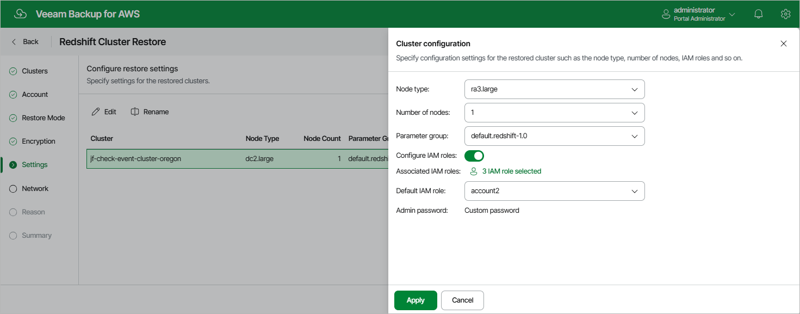

In this article

[This step applies only if you have selected the Restore to original location with different settings option at the Restore Mode step of the wizard]

|  |
| --- |
| Tip |
| As soon as you proceed to the Settings step of the wizard, Veeam Backup for AWS will verify whether the original IAM roles associated with the Redshift cluster added to the restore session still exist in the AWS infrastructure. If the associated roles do not exist in the AWS infrastructure anymore, you will receive a warning in the Associated IAM Roles column. To work around the issue, select other IAM roles to be associated with the restored cluster.  You will also be able to proceed with the wizard and complete the restore operation without associating any new IAM roles. However, you will then need to associate the required roles with the cluster in the AWS Management Console as described in [AWS Documentation](https://docs.aws.amazon.com/redshift/latest/mgmt/default-iam-role.html?icmpid=docs_rs_console_hp_default-iam-role.html#associate-iam). |

At the Settings step of the wizard, provide a new name and specify configuration settings for the restored Redshift cluster:

* To specify a new name, select the cluster and click Rename. Consider the following limitations:

* The cluster identifier must be unique for each AWS Region within one AWS Account.
* The cluster identifier can contain only lowercase Latin letters and hyphens, but cannot contain 2 consecutive hyphens.

* The first character of the cluster identifier must be a letter. The last character of the identifier must not be a hyphen.

* The maximum length of the cluster name is 63 characters.

For more information on limitations for Redshift identifiers, see [AWS Documentation](https://docs.aws.amazon.com/redshift/latest/mgmt/amazon-redshift-limits.html#amazon-redshift-limits-naming).

* To specify configuration settings, select the cluster and click Edit. Then, in the Cluster configuration window, do the following:

1. To choose a node type for the restored cluster, use the Node type drop-down list. For more information on all existing cluster node types, see [AWS Documentation](https://docs.aws.amazon.com/redshift/latest/mgmt/working-with-clusters.html).
2. To choose a number of nodes for the restored cluster, use the Number of nodes drop-down list.

Note that the number of nodes that you can choose depends on the initial configuration of the source cluster. For more information on the node count dependency, see [AWS Documentation](https://docs.aws.amazon.com/redshift/latest/mgmt/resizing-cluster.html).

1. To choose a parameter group containing database parameter values that will be applied to the restored cluster, use the Parameter group drop-down list.

For a parameter group to be displayed in the list of available groups, the group must be created in the Amazon Redshift console as described in [AWS Documentation](https://docs.aws.amazon.com/redshift/latest/mgmt/parameter-group-create.html).

1. To associate IAM roles with the restored cluster or to replace the original IAM roles that are already associated with the cluster, set the Configure IAM roles toggle to On. Then, click the link next to the Associated IAM roles filed to select the necessary roles. Note that the list shows all existing IAM roles from the same AWS account to which the restored cluster belongs.

If you set the toggle to Off, the cluster will be restored without any IAM role associated.

1. To set one of the selected IAM roles as the default one, use the Default IAM role drop-down list. For more information on default IAM roles in Amazon Redshift, see [AWS Documentation](https://docs.aws.amazon.com/redshift/latest/mgmt/default-iam-role.html?icmpid=docs_rs_console_hp_default-iam-role.html#set-default-iam).

|  |
| --- |
| Tip |
| If the admin password that was used to access the source cluster is managed by AWS Secrets Manager, Veeam Backup for AWS will also require an AWS KMS key to encrypt the password for the restored cluster. You can either use the default KMS key or specify a new one — to use the default key, set the Customize encryption settings toggle to Off; to specify a new key, set the toggle to On and select the necessary key from the Admin password drop-down list.  For a KMS key to be displayed in the list of available encryption keys, it must be stored in the AWS Region where the source cluster resides, and the IAM role (or user) specified for the restore operation at [step 3](restore_account_redshift.md) of the wizard must have permissions to access the key. If the necessary KMS key is not displayed in the list, or if you want to use a KMS key from an AWS account other than the AWS account to which the specified IAM role belongs, you can select Add custom key ARN from the AWS KMS key drop-down list, and specify the amazon resource number (ARN) of the key in the Add Custom Key ARN window. For more information on KMS keys, see [AWS Documentation](https://docs.aws.amazon.com/kms/latest/developerguide/create-keys.html). |

Page updated 10/1/2025

Page content applies to build 10.0.0.232
