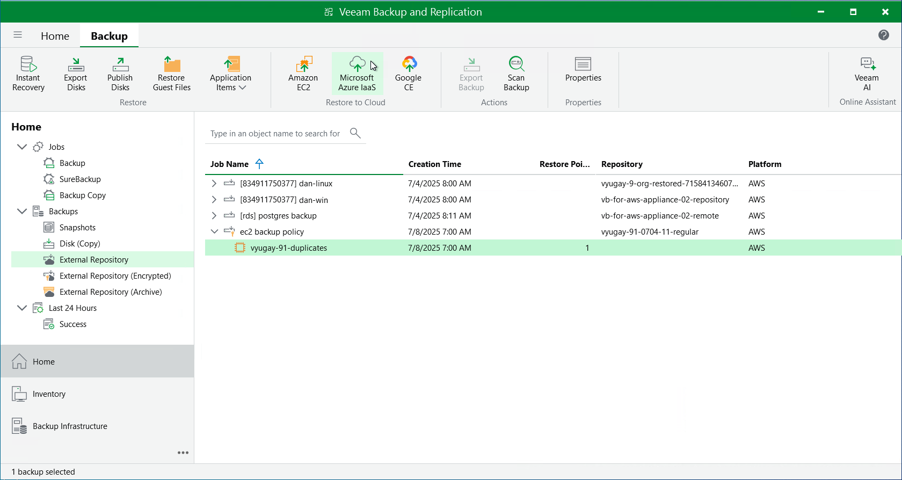

In this article

Veeam Backup & Replication allows you to restore Amazon EC2 instances from image-level backups created with Veeam Backup for AWS to Microsoft Azure as Azure VMs. You can restore EC2 instances to any available restore point. For more information, see the Veeam Backup & Replication User Guide, section [Restore to Microsoft Azure](https://helpcenter.veeam.com/docs/vbr/userguide/restore_azure.html?ver=13).

|  |
| --- |
| Important |
| Restore to Microsoft Azure can be performed only using backup files stored in standard backup repositories for which you have specified access keys of an IAM user whose permissions are used to access the repositories. To learn how to specify credentials for the repositories, see sections [Creating New Repositories](add_s3_account.md) and [Connecting to Existing Appliances](connect_appliance_repo.md). |

Before you start the restore operation:

* Configure the initial settings of an Azure account or Azure Stack account as described in the Veeam Backup & Replication User Guide, section [Configuring Initial Settings](https://helpcenter.veeam.com/docs/vbr/userguide/restore_azure_setup.html?ver=13).

* Check the limitations and prerequisites described in the Veeam Backup & Replication User Guide, section [Before You Begin](https://helpcenter.veeam.com/docs/vbr/userguide/restore_azure_byb.html?ver=13).

To restore an EC2 instance to Microsoft Azure, do the following:

1. In the Veeam Backup & Replication console, open Home view.
2. Navigate to Backups > External Repository.
3. Expand the backup policy that protects an EC2 instance that you want to restore, select the necessary instance and click Microsoft Azure Iaas on the ribbon.
4. Complete the Restore to Microsoft Azure wizard as described in the Veeam Backup & Replication User Guide, section [Restoring to Microsoft Azure](https://helpcenter.veeam.com/docs/vbr/userguide/restore_azure_vm.html?ver=13).

Page updated 8/8/2025

Page content applies to build 10.0.0.232
