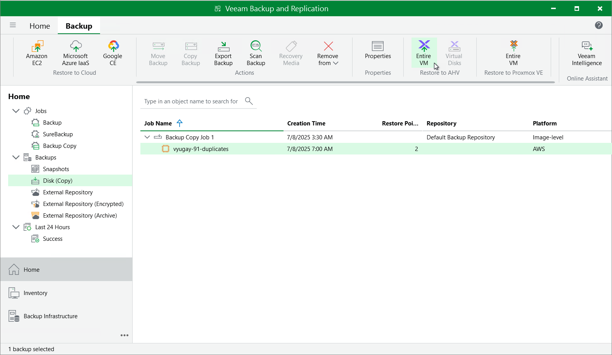

In this article

Veeam Backup & Replication allows you to restore EC2 instances from image-level backups created with Veeam Backup for AWS to Nutanix AHV as Nutanix AHV VMs. You can restore EC2 instances to any available restore point. For more information, see the Veeam Backup for Nutanix AHV User Guide, section [Performing Restore](https://helpcenter.veeam.com/docs/vbahv/userguide/data_recovery.html?ver=9).

|  |
| --- |
| Important |
| Restore to Nutanix AHV can be performed only using backup files stored in standard backup repositories for which you have specified access keys of an IAM user whose permissions are used to access the repositories. To learn how to specify credentials for the repositories, see sections [Creating New Repositories](add_s3_account.md) and [Connecting to Existing Appliances](connect_appliance_repo.md). |

Before you start the restore operation:

* Configure the backup infrastructure as described in the Veeam Backup for Nutanix AHV User Guide, section [Deployment](https://helpcenter.veeam.com/docs/vbahv/userguide/deployment.html?ver=8).

* If you restore EC2 instances from a standard backup, make sure that this backup have been copied to an on-premises backup repository as described in the Veeam Backup & Replication User Guide, section [Creating Backup Copy Jobs for VMs and Physical Machines](https://helpcenter.veeam.com/docs/vbr/userguide/backup_copy_create.html?ver=13).

* If you restore EC2 instances from an archived backup stored in a scale-out backup repository, make sure that this backup have been retrieved from an archive as described in the Veeam Backup & Replication User Guide, section [Retrieving Backup Files](https://helpcenter.veeam.com/docs/vbr/userguide/retrieval_job_launch.html?ver=13).

To restore an EC2 instance to a Nutanix AHV cluster, do the following:

1. In the Veeam Backup & Replication console, open the Home view.
2. Navigate to Backups > Disk (Copy).
3. Expand the necessary backup policy, select the EC2 instance that you want to restore and click Entire VM on the ribbon.
4. Complete the Restore to Nutanix AHV wizard as described in the Veeam Backup for Nutanix AHV User Guide, section [Restoring VMs Using Veeam Backup & Replication Console](https://helpcenter.veeam.com/docs/vbahv/userguide/restore_to_ahv_select_vms.html?ver=9).

Page updated 11/20/2025

Page content applies to build 10.0.0.232
