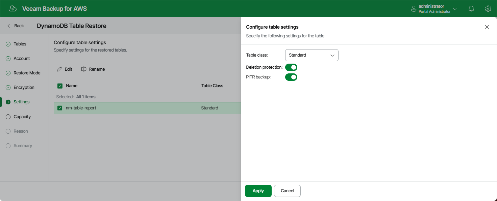

In this article

[This step applies only if you have selected the Restore to new location, or with different settings option at the Restore Mode step of the wizard]

At the Settings step of the wizard, you can specify a new name for the restored table. To do that, select the table and click Rename.

You can also choose a class for the restored table, decide whether you want to protect the table from accidental deletion, and enable point-in-time recovery to prevent accidental writes and to ensure restore to any point in time during the last 35 days. To specify the configuration settings, select the table and click Edit.

|  |
| --- |
| Note |
| By default, the AWS Backup service restores tables with the Standard table class only. To restore a table with the Standard-IA table class, Veeam Backup for AWS updates the table class of the restored table. Keep in mind that you can change table classes no more than two times during a 30-day period.  For more information on considerations and limitations when choosing a table class, see [AWS Documentation](https://docs.aws.amazon.com/amazondynamodb/latest/developerguide/WorkingWithTables.tableclasses.html). |

For more information on deletion protection, see [AWS Documentation](https://docs.aws.amazon.com/amazondynamodb/latest/developerguide/WorkingWithTables.Basics.html#WorkingWithTables.Basics.DeletionProtection). For more information on point-in-time recovery, see [AWS Documentation](https://docs.aws.amazon.com/amazondynamodb/latest/developerguide/PointInTimeRecovery_Howitworks.html).

Page updated 10/1/2025

Page content applies to build 10.0.0.232
