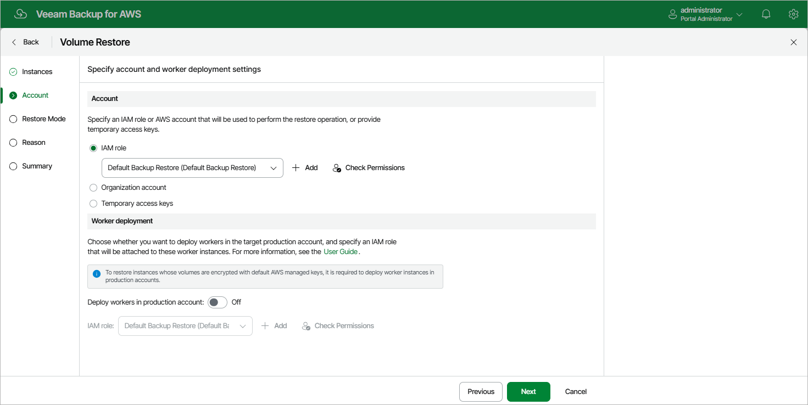

In this article

At the Account step of the wizard, choose whether you want to use an IAM role of a standalone AWS account, an AWS account of an AWS Organization, or one-time access keys of an IAM user to allow Veeam Backup for AWS to perform the restore operation. For information on the permissions that the IAM role or IAM user must have to perform the restore operation, see [EC2 Restore IAM Permissions](role_permissions_restore_ec2.md).

|  |
| --- |
| Note |
| Depending on whether the AWS account to which the source EC2 instances belong is a part of an AWS Organization, Veeam Backup for AWS automatically does either of the following:   * If the AWS account is a part of an AWS Organization, Veeam Backup for AWS chooses the AWS account itself and the organization identity that contains the account — in this case, the Organization account option is selected by default. * If the AWS account is not a part of an AWS Organization, Veeam Backup for AWS chooses an IAM role from the AWS account — in this case, the IAM Role option is selected by default. |

Specifying IAM Role of Standalone AWS Account

To specify an IAM role to be used for the restore operation, select the IAM role option and choose the necessary IAM role from the list. Keep in mind that the selected role must belong to an AWS account to which you plan to restore EBS volumes.

For an IAM role to be displayed in the list of available roles, it must be added to Veeam Backup for AWS with the Amazon EC2 Restore operation selected as described in section [Adding IAM Roles](iam_roles_add.md). If you have not added the necessary IAM role to Veeam Backup for AWS beforehand, you can do it without closing the Volume Restore wizard. To do that, click Add and complete the Add IAM Role wizard.

|  |
| --- |
| Important |
| It is recommended that you check whether the selected IAM role has all the permissions required to perform the operation. If some permissions of the IAM role are missing, the restore operation may fail to complete successfully. To run the IAM role permission check, click Check Permissions and follow the instructions provided in section [Checking IAM Role Permissions](iam_roles_check.md#wizard). |

If you select the IAM role option, you can also choose whether you want Veeam Backup for AWS to deploy worker instances in a production account. For more information, see [Enabling Worker Deployment in Production Account](restore_volume_workers_prod.md).

Specifying AWS Account of AWS Organization

To specify an AWS account to be used for the restore operation, select the Organization account option and do the following:

1. From the Organization drop-down list, choose the necessary organization identity — either an entire AWS Organization or a limited scope of organizational units.

For an organization or a scope of organizational units to be displayed in the list of available identities, it must be added to Veeam Backup for AWS as described in section [Managing AWS Organizations](managing_organizations.md).

1. From the Account drop-down list, choose an account that contains the IAM role whose permissions will be used to perform the restore operation. The role must be specified in the settings of the selected organization identity, as described in section [Adding AWS Organizations](organization_add_settings.md#backup_role) (step 3).

For an AWS account to be displayed in the list of available accounts, it must be included in the the selected organization identity.

|  |
| --- |
| Important |
| It is recommended that you check whether the IAM role specified in the settings of the selected organization identity has all the permissions required to perform the restore operation. If some permissions of the IAM role are missing, the operation may fail to complete successfully. To run the IAM role permission check, click Check Permissions and follow the instructions provided in section [Checking IAM Role Permissions](iam_roles_check.md#wizard). |

If you select the Organization account option, it is recommended that you instruct Veeam Backup for AWS to deploy worker instances in a production account. Since the Amazon EC2 service limits the maximum number of vCPUs that can be provisioned to worker instances deployed in each AWS account and AWS Region, Veeam Backup for AWS may not be able to deploy worker instances in the backup account in case the service quotas are exceeded. To learn how to deploy worker instances in a production account, see [Enabling Worker Deployment in Production Account](restore_volume_workers_prod.md).

Specifying One-Time Access Keys of IAM User

To specify one-time access keys to be used for the restore operation, select the Temporary access keys option, and use the Access key and Secret key fields to provide the [access keys of an IAM user](https://docs.aws.amazon.com/IAM/latest/UserGuide/id_credentials_access-keys.html). Note that the IAM user must belong to an AWS account to which you plan to restore EBS volumes.

|  |
| --- |
| Note |
| Veeam Backup for AWS does not store one-time access keys in the configuration database. |

Page updated 9/29/2025

Page content applies to build 10.0.0.232
