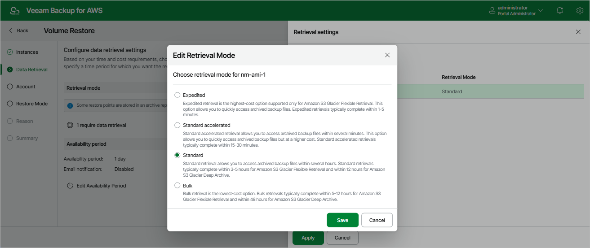
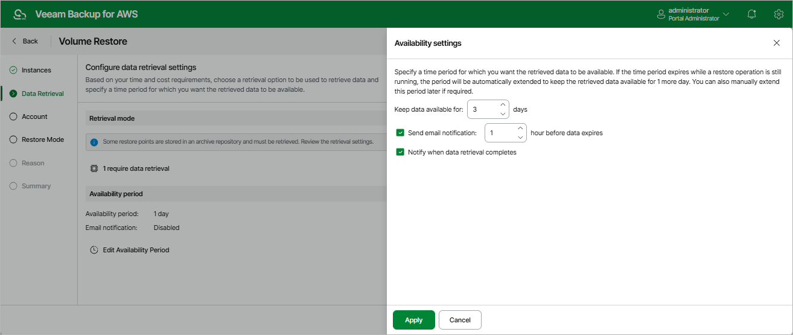

In this article

[This step applies only if you have selected to restore from the archived restore point]

At the Data Retrieval step of the wizard, choose a retrieval mode and specify a period for which you want to keep the data available. To do that:

1. In the Retrieval mode section, click the link.

1. In the Retrieval settings window, for each processed EC2 instance, do the following:

1. Select an EC2 instance and click Edit.
2. In the Edit Retrieval Mode window, select the retrieval mode that Veeam Backup for AWS will use to retrieve the archived data, and click Save. For more information on data retrieval modes, see [Retrieving EC2 Data From Archive](data_retrieval.md).

1. To save changes made to the data retrieval settings, click Apply.

1. In the Availability period section, click Edit Availability Period.

1. In the Availability settings window, specify the number of days for which you want to keep the data available for restore operations. If the time period expires while a restore operation is still running, Veeam Backup for AWS automatically extends the period to keep the retrieved data available for 1 more day. You can also [manually extend the availability period](data_retrieval.md#extend) later if required.
2. To save changes made to the availability period settings, click Apply.

Page updated 9/29/2025

Page content applies to build 10.0.0.232
