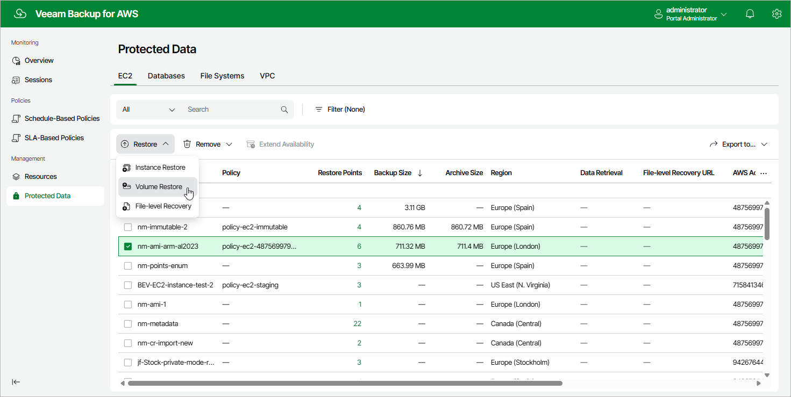

In this article

To launch the Volume Restore wizard, do the following:

1. Navigate to Protected Data > EC2.

1. Select the EC2 instance whose EBS volumes you want to restore.
2. Click Restore > Volume Restore.

Alternatively, click the link in the Restore Points column. Then, in the Available Restore Points window, select the necessary restore point and click Restore > Volume Restore.

Page updated 9/29/2025

Page content applies to build 10.0.0.232
