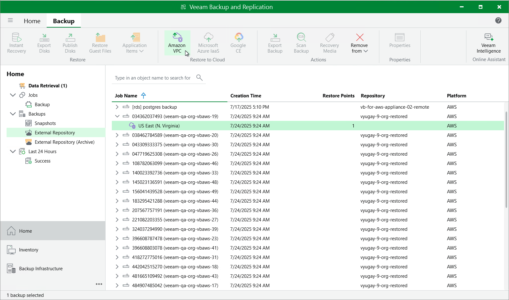

In this article

You can recover corrupted Amazon VPC configurations in the Veeam Backup for AWS UI only. However, you can launch the VPC Restore wizard directly from the Veeam Backup & Replication console to start the restore operation:

1. In the Veeam Backup & Replication console, open the Home view.
2. Navigate to Backups > External Repository.
3. Expand the AWS account in which VPC configuration has been backed up, select the AWS Region whose VPC configuration you to want restore and click Amazon VPC on the ribbon.

Alternatively, you can right-click the selected region and click Restore to Amazon VPC.

Veeam Backup & Replication will open the VPC Restore wizard in a web browser. Complete the wizard as described in section [VPC Configuration Restore](restore_entire_vpc_point.md).

|  |
| --- |
| Important |
| * VPC configuration restore is available only if you have logged in to the Veeam Backup & Replication console under a user account with the Veeam Backup Administrator role. For more information on user roles, see the Veeam Backup & Replication User Guide, section [Managing Users and Roles](https://helpcenter.veeam.com/docs/vbr/userguide/users_roles.html?ver=13).  * Selected items restore of the virtual network configuration is not available from the Veeam Backup & Replication console — you can perform it using the Veeam Backup for AWS Web UI only. For more information, see [Performing Selected Items Restore](vpc_items_restore.md). |

Page updated 10/8/2025

Page content applies to build 10.0.0.232
