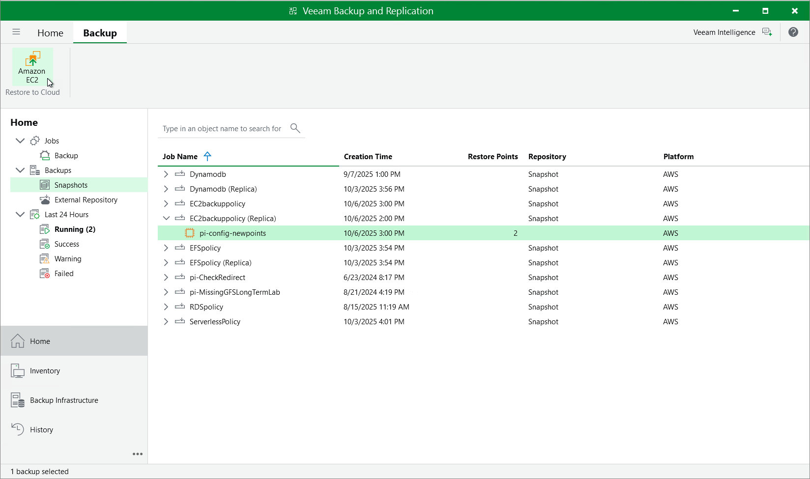

In this article

You can recover corrupted EC2 instances in the Veeam Backup for AWS Web UI only. However, you can launch the EC2 Restore wizard directly from the Veeam Backup & Replication console to start the restore operation:

1. In the Veeam Backup & Replication console, open the Home view.
2. Navigate to Backups > Snapshots if you want to restore from a cloud-native snapshot, or to Backups > External Repository if you want to restore from an image-level backup.
3. Expand the backup policy that protects an EC2 instance that you want to recover, select the necessary instance and click Amazon EC2 on the ribbon.

Alternatively, you can right-click the selected instance and click Restore to Amazon EC2.

Veeam Backup & Replication will open the EC2 Restore wizard in a web browser. Complete the wizard as described in section [EC2 Restore Using Web UI](restore_entire_settings.md).

Page updated 10/6/2025

Page content applies to build 10.0.0.232
