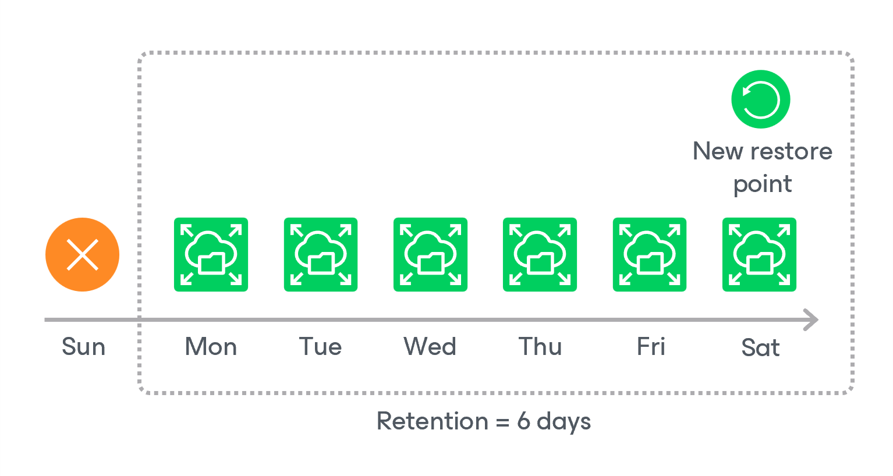

In this article

For EFS file system backups, Veeam Backup for AWS retains restore points for the period of time specified in [backup scheduling settings](add_policy_schedule_retention_efs.md).

During every successful backup session, Veeam Backup for AWS creates a restore point and saves the date, time and applied retention settings in the restore point metadata. If Veeam Backup for AWS detects that the period of time for which the restore point was stored exceeds the period specified in the retention settings, it automatically removes the restore point from the EFS backup chain. You can also remove unnecessary EFS backups manually as described in section [Removing EFS Backups](backups_remove_efs.md).

|  |
| --- |
| Note |
| Veeam Backup for AWS does not apply retention policy to EFS backups created manually. To learn how to remove them, see [Removing EFS Backups Created Manually](backups_remove_individual_efs.md). |

EFS Indexing Retention

When creating an index, Veeam Backup for AWS writes to the index metadata a time stamp when the index must be deleted. The time stamp is defined by the retention specified in the backup policy settings for the first restore point with which the index is associated. If you change retention settings for the backup policy, time stamps of earlier created indexes will not change. However, even if the index must be deleted according to the time stamp, Veeam Backup for AWS will not delete the index until all associated restore points are removed from the Veeam Backup for AWS configuration database.

Page updated 5/21/2025

Page content applies to build 10.0.0.232
