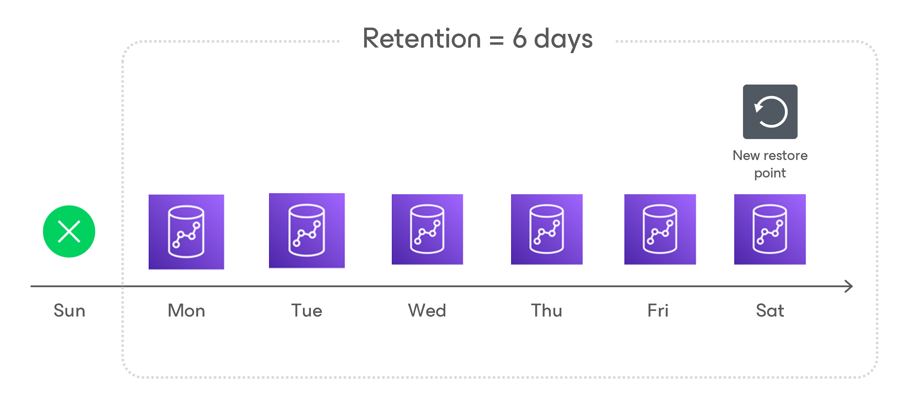

In this article

For Redshift backups, Veeam Backup for AWS retains restore points for the period of time specified in [backup scheduling settings](add_policy_schedule_retention_redshift.md).

During every successful backup session, Veeam Backup for AWS creates a restore point and saves the date, time and applied retention settings in the restore point metadata. If Veeam Backup for AWS detects that the period of time for which the restore point was stored exceeds the period specified in the retention settings, it automatically removes the restore point from the Redshift chain. You can also remove unnecessary Redshift clusters backups manually as described in section [Removing Redshift Backups](backups_remove_redshift.md).

|  |
| --- |
| Note |
| Veeam Backup for AWS does not apply retention policy to Redshift backups created manually. For learn how to remove them, see [Removing Redshift Clusters Backups Created Manually](backups_remove_individual_redshift.md). |

Page updated 11/26/2025

Page content applies to build 10.0.0.232
