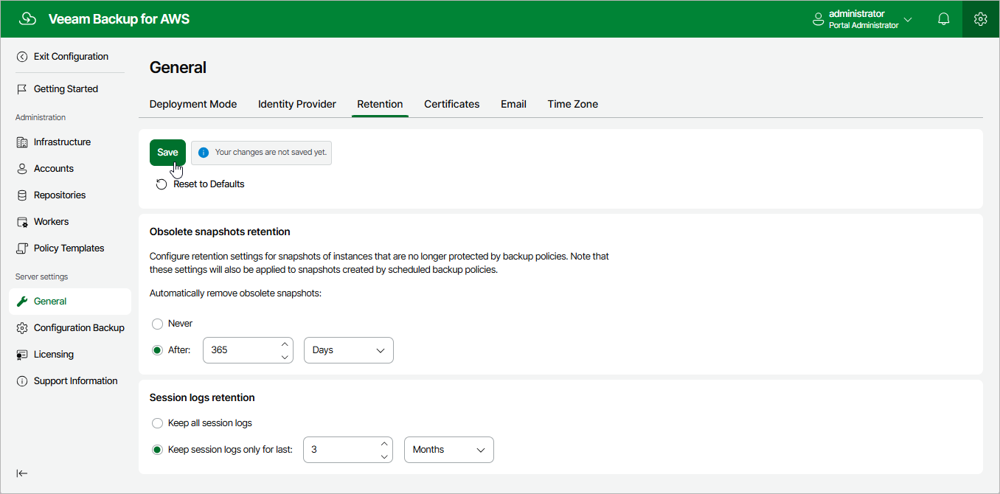

In this article

You can configure global retention settings to specify for how long the following data must be retained in the configuration database:

* [Obsolete snapshots and replicas](#snapshots)
* [Session records](#sessions)

Configuring Retention Settings for Obsolete Snapshots and Replicas

If an instance is no longer processed by a backup policy (for example, it was removed from the backup policy or the backup policy no longer exists), its cloud-native snapshots and snapshot replicas become obsolete. Retention policy settings configured when creating backup policies do not apply to obsolete snapshots — these snapshots are removed from the configuration database according to their own retention settings.

|  |
| --- |
| Note |
| Global retention settings apply to all EC2 and RDS cloud-native snapshots, as well as to snapshot replicas created by the Veeam backup service. If an instance is still processed by a backup policy, but some of its cloud-native snapshots and snapshot replicas are older than the number of days (or months) specified in the global retention settings, these cloud-native snapshots and snapshot replicas will not be removed from Veeam Backup for AWS. |

To configure retention settings for obsolete snapshots and replicas, do the following:

1. Switch to the Configuration page.

1. Navigate to General > Retention.
2. In the Obsolete snapshots retention section, select one of the following options:

* Select the Never option if you do not want Veeam Backup for AWS to remove obsolete snapshots and replicas.

* Select the After option to specify the number of days (or months) during which Veeam Backup for AWS must keep obsolete snapshots in the configuration database. For days, the number must be between 15 and 36135. For months, the number must be between 1 and 1188.

If you select this option, Veeam Backup for AWS will remove obsolete snapshots of an instance as soon as the specified period is over.

1. Click Save.

|  |
| --- |
| Note |
| When Veeam Backup for AWS removes an obsolete snapshot from the configuration database, it also removes the snapshot from AWS. |

Configuring Retention Settings for Session Records

Veeam Backup for AWS stores records for all sessions of performed data protection and disaster recovery operations in the configuration database on the additional data disk attached to the backup appliance. These session records are removed from the configuration database according to their own retention settings. By default, session logs are stored for 3 months.

To configure retention settings for session records, do the following:

1. In the Session logs retention section, select one of the following options:

* Select the Keep all session logs option if you do not want Veeam Backup for AWS to remove session records.

* Select the Keep session logs only for last option if you want to specify the number of days (or months) during which Veeam Backup for AWS must keep session records in the configuration database.

If you select this option, Veeam Backup for AWS will remove all session records that are older than the specified time limit.

1. Click Save.

|  |
| --- |
| Important |
| Retaining all session records in the configuration database may overload the data EBS volume. By default, the volume comes with 20 GB of storage capacity. If you choose not to remove sessions records at all, consider increasing the volume capacity to avoid runtime problems. |

Page updated 7/4/2025

Page content applies to build 10.0.0.232
