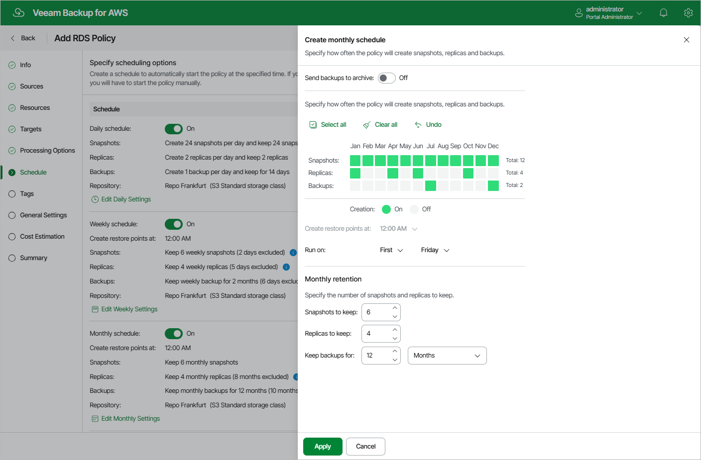

In this article

To create a monthly schedule for the backup policy, at the Schedule step of the wizard, do the following:

1. Set the Monthly schedule toggle to On and click Edit Monthly Settings.
2. [Applies only if you have enabled backup archiving at the [step 5](add_policy_target_settings_backups_rds.md) step of the wizard] In the Create monthly schedule section of the opened window, choose whether you want to store monthly backups in the archive repository.

If you set the Send backups to archive toggle to On, follow the instructions provided in section [Enabling Backup Archiving](backup_archiving_rds.md).

1. In the Create monthly schedule section, select months when the backup policy must create cloud-native snapshots, snapshot replicas or image-level backups.

|  |
| --- |
| Note |
| Veeam Backup for AWS does not create snapshot replicas and image-level backups independently from cloud-native snapshots. That is why when you select months to create snapshot replicas and image-level backups, the same months are automatically selected for cloud-native snapshots. To learn how Veeam Backup for AWS performs backup, see [RDS Backup](backup_hiw_rds.md). |

1. Use the Create restore point at and Run on drop-down lists to schedule a specific time and day for the backup policy to run.

|  |
| --- |
| Notes |
| * If you have selected a specific time for the backup policy to run at the Weekly schedule section of the Schedule step of the wizard, you will not be able to change the time for the monthly schedule unless you select the On day option from the Run on drop-down list.  * If you select the On day option, [harmonized scheduling](harmonized_scheduling_rds.md) cannot be guaranteed. Plus, to support the On day option, Veeam Backup for AWS will require to create an additional temporary restore point if there are no other schedules planned to run on that day. However, the temporary restore point will be removed from AWS during the Backup Retention process within approximately 24 hours, to reduce unexpected infrastructure charges. |

1. In the Monthly retention section, configure retention policy settings for the monthly schedule:

* For cloud-native snapshots and snapshot replicas, specify the number of restore points that you want to keep in cloud-native snapshot and snapshot replica chains.

If the restore point limit is exceeded, Veeam Backup for AWS removes the earliest restore point from each chain. For more information, see [RDS Snapshot Retention](retention_snapshots_rds.md).

* For image-level backups, specify the number of days (or months) for which you want to keep restore points in a backup chain.

If a restore point is older than the specified time limit, Veeam Backup for AWS removes the restore point from the chain. For more information, see [RDS Backup Retention](retention_backup_rds.md).

1. To save changes made to the backup policy settings, click Apply.

|  |
| --- |
| Tip |
| Veeam Backup for AWS will start applying the configured retention settings as soon as the backup policy produces restore points. Even if you disable the monthly schedule after the restore points are created, the retention policy will still be applied to these restore points. As a workaround, you can modify the configured retention settings. |

Page updated 7/25/2025

Page content applies to build 10.0.0.232
