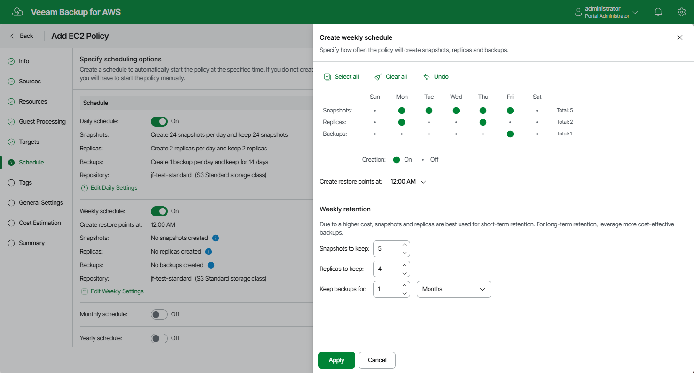

In this article

To create a weekly schedule for the backup policy, at the Schedule step of the wizard, do the following:

1. Set the Weekly schedule toggle to On and click Edit Weekly Settings.
2. In the Create weekly schedule section, select weekdays when the backup policy will create cloud-native snapshots, snapshot replicas or image-level backups.

|  |
| --- |
| Note |
| Veeam Backup for AWS does not create snapshot replicas and image-level backups independently from cloud-native snapshots. That is why when you select days to create snapshot replicas and image-level backups, the same days are automatically selected for cloud-native snapshots. To learn how Veeam Backup for AWS performs backup, see [EC2 Backup](backup_hiw_ec2.md). |

1. Use the Create restore point at drop-down list to schedule a specific time for the backup policy to run.
2. In the Weekly retention section, configure retention policy settings for the weekly schedule:

* For cloud-native snapshots and snapshot replicas, specify the number of restore points that you want to keep in cloud-native snapshot and snapshot replica chains.

If the restore point limit is exceeded, Veeam Backup for AWS removes the earliest restore point from the chain. For more information, see [EC2 Snapshot Retention](retention_snapshots.md).

* For image-level backups, specify the number of days (or months) for which you want to keep restore points in a backup chain.

If a restore point is older than the specified time limit, Veeam Backup for AWS removes the restore point from the chain. For more information, see [EC2 Backup Retention](retention_backup.md).

1. To save changes made to the backup policy settings, click Apply.

|  |
| --- |
| Tip |
| Veeam Backup for AWS will start applying the configured retention settings as soon as the backup policy produces restore points. Even if you disable the weekly schedule after the restore points are created, the retention policy will still be applied to these restore points. As a workaround, you can modify the configured retention settings. |

Considerations and Limitations

When you configure retention policy settings, consider the following:

* For Veeam Backup for AWS to be able to use the [Changed Block Tracking](cbt.md) (CBT) mechanism when processing EC2 instance data, you must keep at least one cloud-native snapshot in the snapshot chain.

* Regardless of the number of restore points that you specify, Veeam Backup for AWS permanently retains an additional cloud-native snapshot in the chain by design, which is required for proper CBT functioning.

* It is recommended that you do not set the Snapshots to keep value to 0. Otherwise, Veeam Backup for AWS will not be able to use the CBT mechanism, and the completion time of incremental backups may occur to grow significantly.

To learn how the CBT mechanism works, see [Changed Block Tracking](cbt.md).

Page updated 9/22/2025

Page content applies to build 10.0.0.232
