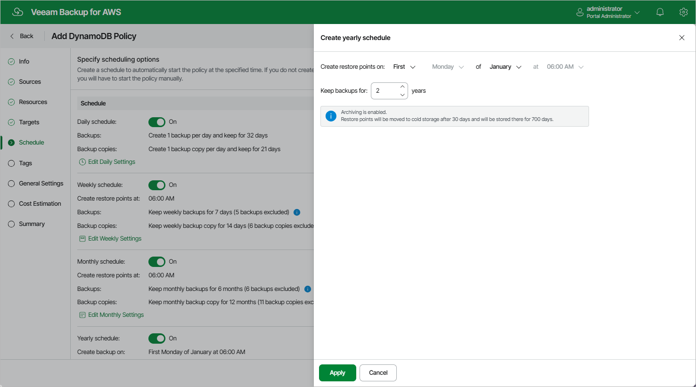

In this article

The yearly schedule is applied only to DynamoDB backups, no backup copies are created according to this schedule.

To create a yearly schedule for the backup policy, at the Schedule step of the wizard, do the following:

1. Set the Yearly schedule toggle to On and click Edit Yearly Settings.
2. In the Create yearly schedule section, specify a day, month and time when the backup policy will create table backups.

For example, if you select First, Friday, January and 06:00 PM, the backup policy will run every first Friday of January at 06:00 PM.

|  |
| --- |
| Notes |
| * If you have selected a specific time and day for the backup policy to run at the Weekly schedule or Monthly schedule sections of the Schedule step of the wizard, you will not be able to change the time and day for the yearly schedule unless you select the On day option.  * If you select the On day option, [harmonized scheduling](harmonized_scheduling_dynamo.md) cannot be guaranteed. |

1. In the Keep backups for field, specify the number of years for which you want to keep restore points in a backup chain.

If a restore point is older than the specified time limit, Veeam Backup for AWS removes the restore from the chain. For more information, see [DynamoDB Backup Retention](retention_backup_dynamo.md).

1. To save changes made to the backup policy settings, click Apply.

|  |
| --- |
| Tip |
| Veeam Backup for AWS will start applying the configured retention settings as soon as the backup policy produces restore points. Even if you disable the yearly schedule after the restore points are created, the retention policy will still be applied to these restore points. As a workaround, you can modify the configured retention settings. |

Page updated 9/23/2025

Page content applies to build 10.0.0.232
