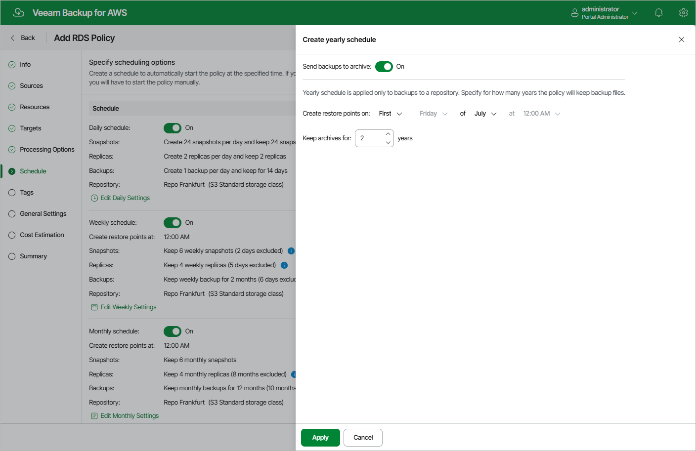

In this article

[This step applies only if you have instructed Veeam Backup for AWS to create image-level backups at the Targets step of the wizard]

To create a yearly schedule for the backup policy, at the Schedule step of the wizard, do the following:

1. Set the Yearly schedule toggle to On and click Edit Yearly Settings.
2. [Applies only if you have enabled backup archiving at the [step 5](add_policy_target_settings_backups_rds.md) step of the wizard] In the Create yearly schedule section of the opened window, choose whether you want to store yearly backups in the archive backup repository.

If you set the Send backups to archive toggle to On, follow the instructions provided in section [Enabling Backup Archiving](backup_archiving_rds.md).

1. In the Create yearly schedule section, specify a day, month and time when the backup policy will create image-level backups.

For example, if you select First, Friday, January and 06:00 PM, the backup policy will run every first Friday of January at 06:00 PM.

|  |
| --- |
| Notes |
| * If you have selected a specific time and day for the backup policy to run at the Weekly schedule or Monthly schedule sections of the Schedule step of the wizard, you will not be able to change the time and day for the yearly schedule unless you select the On day.  * If you select the On day option, [harmonized scheduling](harmonized_scheduling_rds.md) cannot be guaranteed. Plus, to support the On day option, Veeam Backup for AWS will require to create an additional temporary restore point if there are no other schedules planned to run on that day. However, the temporary restore point will be removed from AWS during the Backup Retention process within approximately 24 hours, to reduce unexpected infrastructure charges. |

1. In the Keep backups for field, specify the number of years for which you want to keep restore points in a backup chain.

If a restore point is older than the specified time limit, Veeam Backup for AWS removes the restore point from the chain. For more information, see [RDS Backup Retention](retention_backup_rds.md).

1. To save changes made to the backup policy settings, click Apply.

|  |
| --- |
| Tip |
| Veeam Backup for AWS will start applying the configured retention settings as soon as the backup policy produces restore points. Even if you disable the yearly schedule after the restore points are created, the retention policy will still be applied to these restore points. As a workaround, you can modify the configured retention settings. |

Page updated 12/5/2025

Page content applies to build 10.0.0.232
