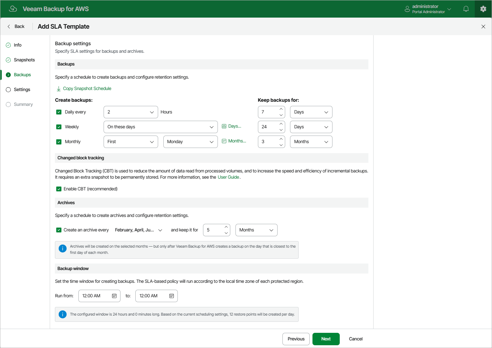

In this article

At the Backups step of the wizard, you can configure the following backup settings:

1. In the Backups section, you can instruct Veeam Backup for AWS to create backups on a daily, weekly and monthly basis, and to keep the created backups in a backup chain for a specific number of days, months or years. If a backup is older than the specified time limit, Veeam Backup for AWS removes the backup from the chain.

|  |
| --- |
| Tip |
| Veeam Backup for AWS allows you to quickly configure a backup schedule by applying the same settings that you have configured at [step 3](sla_add_snapshot_settings.md) of the wizard. To do that, click Copy Snapshot Schedule. |

1. In the Changed block tracking section, you can enable the changed block tracking (CBT) mechanism that allows Veeam Backup for AWS to reduce the amount of data read from processed EBS volumes.

Enabling CBT increases the speed and efficiency of backup operations but can incur additional costs of storing restore points in AWS. For more information, see [Snapshot Handling for Image-Level Backups](temporary_restore_points.md).

1. In the Archives section, you can instruct Veeam Backup for AWS to store backed-up data in the low-cost, long-term archive storage, and to keep the archived data for a specific time period.

Note that it is usually more expensive and takes more time to restore data from archived backups than from regular backups as it requires Veeam Backup for AWS to retrieve the data from the archive storage. For more information, see [Retrieving EC2 Data From Archive](data_retrieval.md).

|  |
| --- |
| Note |
| By design, archives are created according to the configured monthly schedule but only after Veeam Backup for AWS creates an image-level backup on the day that is closest to the first day of each month. |

1. In the Backup window section, you can instruct Veeam Backup for AWS to create daily backups within a specific time interval if you do not want backup operations to overlap production hours.

Veeam Backup for AWS automatically adjusts the specified backup window to the time zone of each AWS Region added to SLA-based backup policies that have this SLA template assigned. For more information, see [Data Protection Windows](snapshot_backup_window.md).

When you combine multiple types of backup schedules, Veeam Backup for AWS re-uses backups created according to a more-frequent schedule (daily or weekly) to achieve the desired SLA compliance for less-frequent schedules (weekly and monthly). For example, if you configure a daily and a monthly schedule, the first daily snapshot successfully created on a day scheduled for the monthly snapshot will be marked as both a daily and a monthly snapshot.

Page updated 11/24/2025

Page content applies to build 10.0.0.232
