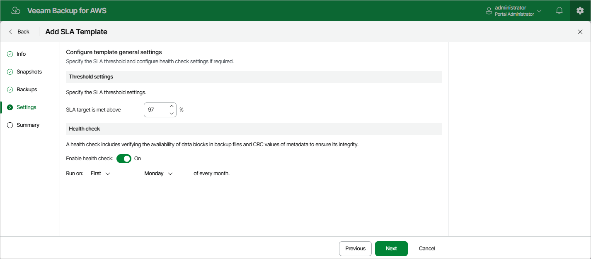

In this article

At the Settings step of the wizard, you can specify SLA threshold settings and schedule health checks for the SLA template.

SLA Threshold Settings

The SLA threshold is a percentage of successfully created restore points out of the total number of restore points expected to be produced by an SLA-based backup policy (97% by default). Based on this percentage, Veeam Backup for AWS estimates the SLA compliance ratio for all SLA-based backup policies that have this SLA template assigned. For more information, see [How Veeam Backup for AWS Estimates SLA Compliance](sla_calculation.md).

Health Check Settings

If you have configured a backup schedule at [step 4](sla_add_backup_settings.md) of the wizard, you can instruct Veeam Backup for AWS to periodically perform a health check for backup restore points created by all SLA-based backup policies that have this SLA template assigned. During the health check, Veeam Backup for AWS performs an availability check for data blocks in the whole regular backup chain, and a cyclic redundancy check (CRC) for metadata to verify its integrity. The health check helps you ensure that the restore points are consistent and that you will be able to restore data using these restore points. For more information on the health check, see [How Health Check Works](sla_add_general_settings_2.md).

To instruct Veeam Backup for AWS to perform a health check, do the following:

1. In the Health check section of the step, set the Enable health check toggle to On.
2. Use the Run on drop-down lists to schedule a specific day for the health check to run.

Page updated 11/21/2025

Page content applies to build 10.0.0.232
