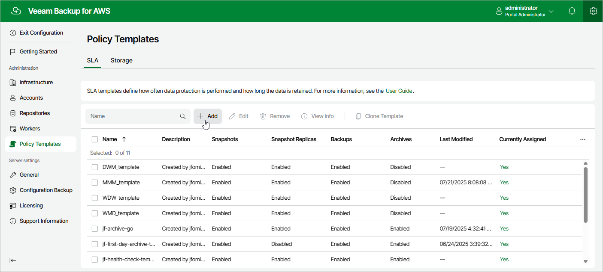

In this article

To launch the Add SLA Template wizard, do the following:

1. Switch to the Configuration page.

1. Navigate to Policy Templates > SLA.

1. Click Add.

Page updated 7/28/2025

Page content applies to build 10.0.0.232
